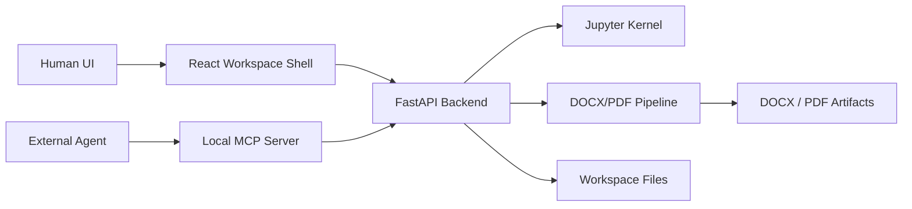

# Inspyro

**AI-native engineering workspace for calculations, notebooks and report generation.**

Agents can inspect a project, edit notebooks, run calculations and deliver DOCX/PDF reports.

Inspyro is an open source workspace for engineering teams that want local execution, notebook-first authoring, traceable report generation, and agent workflows in the same environment. The notebook, editor, explorer, and document pipeline are still there, but the product is now framed around outcomes: understand the project, run engineering calculations, and ship report artifacts.

## Why Inspyro

- Agent-first engineering workflow: local agents can inspect project files, drive notebook execution, and update reports through the built-in MCP layer.
- Notebook runtime with real Python: calculations run on a real Jupyter kernel instead of a simulated playground.
- Report artifacts built into the workflow: notebooks can generate DOCX and PDF deliverables with the custom DOCX builder and Office math pipeline.
- Traceability by design: project files, notebook cells, figures, tables, and final artifacts stay connected.
- Local-first architecture: backend, frontend, desktop shell, and MCP server run on your machine.

## Product Story

Inspyro is designed around three promises:

1. **Understand the project**: inspect the workspace, the notebook, the engineering inputs, and the template.
2. **Run engineering calculations**: execute real Python, review variables, graphs, units, and dependency context.
3. **Ship report artifacts**: generate DOCX/PDF outputs that remain connected to the source notebook and project files.

## Canonical Demo

The repository includes a canonical example workspace in [examples/structural-report-demo](examples/structural-report-demo/README.md).

Demo flow:

1. Open the example workspace in Inspyro.
2. Review `inputs/beam_case.json`, `beam_design.py`, and `beam_report.ipynb`.
3. Run all notebook cells.
4. Inspect the generated document in the `Document` view.
5. Connect an MCP client and repeat the same flow through the agent-facing surface.

## Quickstart

### Human UI

Windows:

```powershell
python -m venv venv_inspyro
.\venv_inspyro\Scripts\activate
pip install -r backend/requirements.txt
cd frontend
npm install
cd ..
.\restart_inspyro.ps1
```

Linux / WSL:

```bash
python3 -m venv venv_inspyro
source venv_inspyro/bin/activate
pip install -r backend/requirements.txt
cd frontend && npm install && cd ..
./restart_inspyro.sh
```

Once the app is running:

1. Click `Start from example` on the launcher, or open [examples/structural-report-demo](examples/structural-report-demo/README.md) as your workspace.
2. Open `beam_report.ipynb`.
3. Run the notebook.
4. Open the generated DOCX/PDF artifact from the `Document` view.

### MCP / Agents

Start the backend first, then run the local MCP server:

```powershell
cd backend
python -m mcp_server
```

Useful variants:

```powershell
python -m mcp_server --stdio
python -m mcp_server --json-response --stateless-http
python -m mcp_server --wait-for-backend 20
```

Default MCP endpoint:

```text
http://127.0.0.1:8100/mcp
```

Recommended agent flow:

1. Read `inspyro://manifest`.
2. Read `inspyro://guides/start-here`.
3. Open or create a notebook-first session.
4. Load the structural report demo workspace.
5. Run calculations and export report artifacts.

## Architecture



## Repository Guide

- [CONTRIBUTING.md](CONTRIBUTING.md): contribution workflow and checks.
- [SECURITY.md](SECURITY.md): vulnerability reporting guidance.
- [examples/structural-report-demo](examples/structural-report-demo/README.md): canonical demo workspace.
- [docs/agents/quickstart.md](docs/agents/quickstart.md): agent/operator quickstart.
- [AGENTS.md](AGENTS.md): repo-local agent instructions and source-of-truth order.

## Open Source Launch Priorities

The current open source wedge is structural calculation and engineering report generation, while the public category is broader: an AI-native engineering workspace. The near-term focus is:

- a clear example workspace
- a reproducible agent demo
- fast local installation
- real pilot users with repeatable reporting workflows

## License

Inspyro is released under the [Apache License 2.0](LICENSE).
