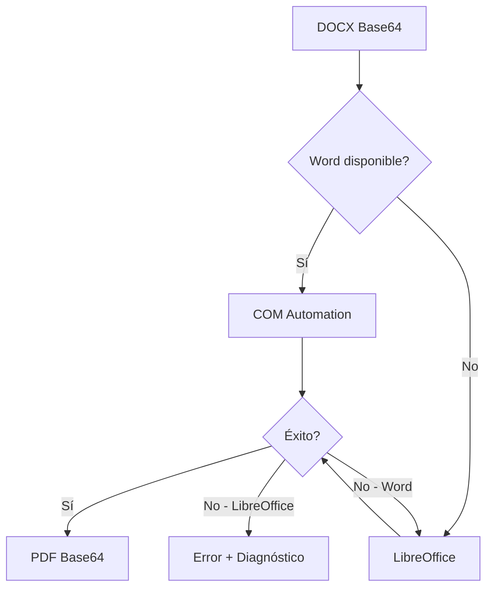
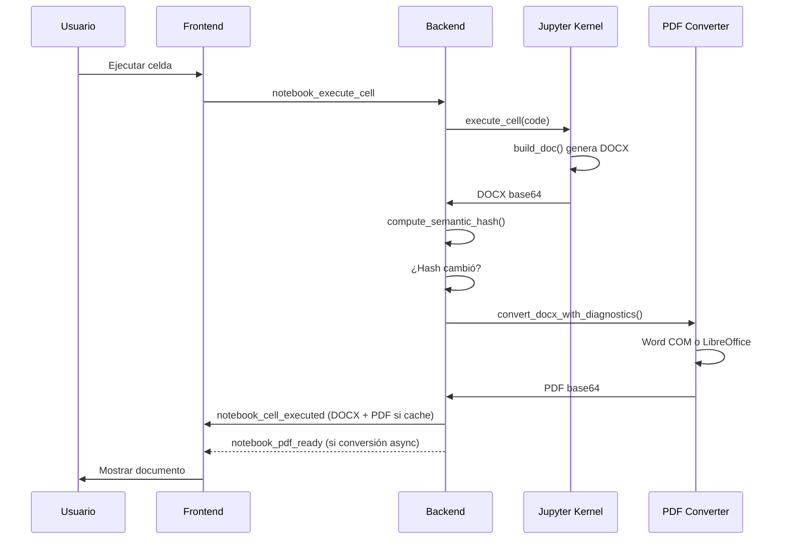

# Generación de Documentos DOCX/PDF

> **Estado:** ✅ Modularizado  
> **Última actualización:** 2026-05-02
> **Changelog:** `docs/changelog/01-document-generation-docx.md`

Este documento cubre todo el pipeline de generación de documentos: desde la creación de DOCX hasta la conversión a PDF.

## Delimitadores LaTeX anidados en OMML (2026-05-02)

- La ruta `math_latex()` mantiene la normalización MathML previa al XSL para convertir fences `\left...\right` a delimitadores extensibles nativos de Word.
- Esa normalización ahora empareja cierres con profundidad anidada, por lo que un `\left(` externo no se cierra accidentalmente con paréntesis internos de funciones como `\min(...)`, `\max(...)` o agrupaciones simples.
- El contenido promovido a `mfenced` se envuelve como un único `mrow`; así el XSL produce un único operando `m:e` en OMML y evita que Word muestre separadores espurios, apóstrofos visuales o dobles signos dentro de fórmulas.
- La cobertura mantiene compatibilidad con matrices, `cases`, delimitadores angulares y operadores n-arios dentro de fences complejos.

## Celdas DOCX nativas en notebooks (2026-04-28)

- Las celdas que escriben o mutan el informe DOCX se formalizan como `cell_type: "docx"` en `.ipynb`; siguen ejecutándose como Python, pero su tipo expresa intención documental.
- `emit_docx` conserva su rol de modo documental de la corrida/batch y no se reduce a “la celda es DOCX”: la detección por fuente (`build_doc`, `doc_reset`, `math_latex`, etc.) sigue activa para notebooks legacy y clientes MCP sin metadata.
- Apagar DOCX/PDF o ejecutar MCP con `include_docx=false` solo omite esas celdas; no limpia `mdoc`, no borra bloques existentes y no invalida el último DOCX/PDF visible. La próxima corrida documental real vuelve a reemplazar el artefacto mediante el pipeline latest-wins.

## Workbench DOCX nativo (2026-04-25)

- Inspyro absorbe capacidades útiles de `Documents` como código propio, no como dependencia runtime: QA visual disciplinado, auditoría OOXML, comentarios/redlines, fields, publicación limpia, SDTs, redacción, protección y diff.
- `backend/app/services/docx_core/` centraliza lectura ZIP/XML, namespaces, story parts, relationships, content types, texto visible y mutaciones transaccionales; `docx_quality/` se apoya en ese núcleo para evitar duplicación entre auditoría, publicación, SDTs y operaciones futuras.
- `docx_quality/workbench.py` expone operaciones tipadas (`audit`, `render_manifest`, `render_page`, `render_all_pages`, `clear_render_cache`, `clean`, `prepare_delivery`, `comments_*`, `redlines_*`, `fields_*`, `redact`, `protect`, `content_controls_*`, `diff`) y siempre conserva el artefacto original inmutable. Las operaciones que modifican contenido generan variantes nuevas con trazabilidad, resources y summary persistido.
- La auditoría v2 usa perfiles `quick`, `agent`, `delivery`, `visual` y `publishing`; cada finding queda normalizado con `severity`, `code`, `section`, `location`, `suggestion`, `source` y `fixable`, más conteos estables y score. La revisión de hyperlinks marca texto genérico incluso en variantes acentuadas como `aquí`.
- El render visual sigue siendo Inspyro-native: DOCX -> PDF con `pdf_converter.py` y PDF -> PNG con PyMuPDF. `docx_render_cache.py` persiste el PDF por `binary_hash + renderer_signature + profile`, rasteriza PNGs por página/zoom bajo demanda y evita reconvertir el mismo binario al inspeccionar varias páginas. No se usa `artifact-tool`.
- El builder incorpora mejoras de entrega sin sobrecargar la API: `image(..., alt_text=...)`, `figure(..., alt_text=...)`, tablas con header row repetible, anchos/padding/alineación explícitos y `doc_finalize(profile="delivery")` como postproceso local de revisión.
- Los endpoints legacy `/api/docx/quality/*` quedan compatibles; el contrato nuevo es `/api/docx/workbench/*`, con results/resources link-first y sin blobs inline salvo descargas explícitas.
- Los resources Workbench/render validan `workbench_id`/`render_id` como segmentos seguros y comprueban que la ruta resuelta permanezca dentro del store/cache antes de servir bytes, de modo que handles traversal o rutas inesperadas fallan sin leer fuera del directorio controlado.

---

## Update 2026-04-20

- La materialización visible en `Docx_Documents` ya no deriva solo del `active_workspace` global: `docx_artifacts.py` resuelve primero el workspace desde `source_path` del notebook/archivo origen y solo degrada al workspace activo si no puede reconstruir ese contexto.

- Esto evita que una corrida documental de notebook A, iniciada antes de que el usuario cambie de proyecto, termine escribiendo su copia visible dentro del workspace activo de notebook B.

---

## Cola async del convertidor PDF para notebooks paralelos (2026-04-19)

- El camino notebook-first deja de empujar todas las conversiones PDF al `ThreadPoolExecutor` genérico mientras esperan internamente el lock global de Word.
- `pdf_converter.py` mantiene ahora una puerta async explícita para el camino Word-capable y usa executors dedicados (`inspyro-word-pdf` serializado y `inspyro-pdf` genérico), de modo que notebooks paralelos no queden consumiendo workers compartidos solo por estar esperando turno del convertidor externo.
- Cuando el convertidor Word ya está ocupado, el notebook que llega después puede entrar en estado visible de espera (`Esperando turno del convertidor PDF...`) y el diagnóstico publica `pdf_queue_wait_ms` dentro de `stage_timings_ms`.
- El objetivo no es forzar paralelismo inseguro sobre Word, sino aislar la contención del convertidor para que no derive en falsos errores o “pegados” cruzados entre notebooks.

---

## Contrato Word-first por slots semánticos (2026-04-19)

- `DocxSession` transporta ahora `semantic_style_slots` desde la metadata del template hacia el runtime del kernel junto con `template_path`, `table_style_runtime_defaults` y `builder_required_style_defaults`.
- `DocBuilder.text()` resuelve por default el slot `body`; `heading(level)` usa `heading_{level}`, `list()` usa `list_bullet` / `list_number`, `code()` usa `code`, los captions usan `caption` y `table()` / `dataframe()` usan `table_default` cuando no reciben `style=` explícito.
- `Normal` queda como fallback técnico y base de herencia, no como contrato público de autoría para cuerpo. La apariencia Word real la decide el template mediante slots semánticos y `docDefaults`.
- `DocBuilder.resolve_style_slot(slot_name)` expone una salida mínima para casos low-level con `builder.document`, evitando hardcodear nombres Word en notebooks DOCX avanzados.

---

## Entrega WS link-first en notebooks paralelos (2026-04-19)

- El pipeline documental notebook-first ahora prefiere `docx_ref` / `docx_file_token` y `pdf_ref` / `pdf_file_token` en `notebook_docx_update`, `notebook_pdf_ready` y `force_reconvert_pdf` incluso cuando el artefacto es pequeño y podría inlinearse.
- El base64 inline queda como fallback cuando no existe una referencia descargable estable; esto mantiene compatibilidad de contrato, pero evita que un notebook que acaba de producir DOCX/PDF meta blobs visibles en el mismo WebSocket y friccione la ejecución paralela de otro notebook.
- El objetivo operativo es reducir bloqueo por head-of-line en la conexión compartida del shell sin cambiar la semántica latest-wins del artifact store ni el lookup estable por `artifact_id` / `source_path` / `kernel_id`.

---

## Materialización workspace-backed + file handoff + timings (2026-04-18)

- `docx_artifacts.py` mantiene el blob raw deduplicado por `binary_hash` para provenance, reconversión PDF e historial restart-safe, pero además materializa cada generación final visible dentro del workspace activo en `<workspace>/Docx_Documents/Docx_document_YYYY-MM-DD_HH-mm-ss-SSS.docx`.
- Si dos generaciones caen en el mismo milisegundo, el nombre visible agrega un sufijo corto derivado de `artifact_id`; no se reutiliza un nombre fijo aunque el binario coincida.
- Si una nueva persistencia llega con el mismo `execution_id` y el mismo `binary_hash` para el mismo origen, backend reutiliza la copia ya materializada en `Docx_Documents` en vez de duplicarla visualmente.
- Si no existe `active_workspace` o el destino no puede verificarse como contenido dentro del proyecto, backend no escribe fuera del workspace: conserva el artifact estable en app-state, mantiene `artifact_id`/historial y registra un warning no bloqueante.
- El handoff notebook -> backend ya no depende solo del stream base64 por `stdout`: la ruta productiva usa un intercambio file-backed por ejecución y deja el camino `stdout` solo como fallback defensivo.
- `GET /api/docx/download?artifact_id=...` y los lookups estables por `source_path`/`kernel_id` priorizan ahora la copia workspace-backed o, si no existe, un delivery-cache saneado por `binary_hash`; eso evita re-sanitizar el mismo DOCX en descargas repetidas y mantiene el blob raw intacto para PDF/provenance.
- `_prepare_docx_payload()` pasa la variante delivery saneada al artifact store, deja el token legacy temporal solo como fallback cuando falla el artifact store y publica `document_timing_ms` con al menos `sanitize_ms`, `artifact_store_ms`, `legacy_store_ms`, `workspace_write_ms`, `index_write_ms`, `kernel_export_ms`, `transport_read_ms` y `transport_cleanup_ms`.
- `pdf_converter.py` agrega `stage_timings_ms` por conversión (`cache_lookup_ms`, `b64_decode_ms`, `pdf_validation_ms`, `docx_repair_ms`, `pdf_convert_ms`) y cachea la validación estructural del DOCX para hashes repetidos antes de intentar Word/LibreOffice.
- `/api/docx/history` expone también `workspace_path`, `workspace_relpath` y `workspace_warning`, de modo que desktop/frontend puedan abrir la copia persistida del proyecto cuando exista.

---

## Sanitización de procedencia para toda entrega Word-visible (2026-04-17)

- `backend/app/services/docx_sanitizer.py` sanea ahora el paquete OOXML completo de entrega (`document`, `header*`, `footer*`, `footnotes`, `endnotes`, `comments` y cualquier otra story Word relevante) y elimina tanto hyperlinks OOXML como field codes `HYPERLINK` que apunten a `/api/docx/provenance/open?...`.
- El artifact store persistente y la copia interna que consume la conversión PDF conservan intactos esos hyperlinks, de modo que `Modo origen`, `notebook_pdf_ready` y `force_reconvert_pdf` siguen funcionando sin cambios de contrato.
- `docx_builder.session` expone dos variantes explícitas: `serialize_docx_bytes()` / `export_docx_base64()` siguen siendo raw para PDF/reconversión, mientras `serialize_docx_bytes_for_delivery()` / `export_docx_base64_for_delivery()` producen la copia Word-visible saneada.
- `doc_export(format='docx'|'bytes'|'path')` devuelve siempre la variante delivery saneada; el acceso raw queda reservado a la sesión interna usada por notebook recovery, cache PDF y reconversión.
- `_prepare_docx_payload()` usa la copia saneada para `docx_file_b64`, el storage temporal legacy por token y `docx_size_bytes` visibles; el DOCX original sigue siendo el source of truth para PDF y para reconversiones desde artifact persistido.
- `GET /api/docx/download` devuelve bytes saneados para descargas por `artifact_id`, `token`, lookup estable por `source_path`/`kernel_id` y fallback runtime por `kernel_id`; los links normales del usuario o de la plantilla no se tocan.
- `tools/repair_docx_provenance.py` reutiliza el mismo sanitizer productivo para limpiar DOCX ya descargados, generando por defecto una copia `*-clean.docx`.

---

## Hotfix de proxies DOCX y patrón notebook final-only (2026-04-15)

- `docx_builder/proxies.py` deja de usar truth-testing implícito sobre nodos OOXML (`_element or _rPr` / `_element or _pPr`) y pasa a seleccionar el target con chequeo explícito `is not None`, eliminando el `FutureWarning` de `lxml/python-docx` sin cambiar la semántica de tracking.
- `backend/tests/test_docx_builder_tracking.py` agrega cobertura específica para mutaciones `run.font.*` y `paragraph.paragraph_format.*`, verificando tanto la ruta principal (`_element`) como los fallbacks (`_rPr` / `_pPr`) y fijando ausencia de `FutureWarning`.
- En notebooks grandes con mucho `builder.document`, la mejora visible no depende solo del hotfix backend: conviene mantener la generación documental detrás de la bandera existente `GENERAR_DOCX`, dejando `False` para iteración y `True` solo para la corrida final del informe.
- El notebook objetivo `G135_Analisis_Estructural.ipynb` adopta además un guard local para inicializar estilos DOCX una sola vez por documento, reduciendo trabajo repetitivo en títulos, fuentes y tablas sin alterar la lógica de análisis estructural.

---

## Timeouts documentales largos alineados a 600s (2026-04-15)

- `pdf_converter.py` sube el default general `INSPYRO_PDF_TIMEOUT` a `600s`, de modo que conversiones DOCX/PDF fuera del camino notebook puro no vuelvan a quedar limitadas por el techo histórico de `25s`.
- El flujo notebook sigue usando `INSPYRO_NOTEBOOK_PDF_TIMEOUT=600` como presupuesto específico de postproceso documental, pero ahora el conversor base y la reconversión MCP/documental quedan alineados con el mismo orden de magnitud.
- Los timeouts cortos de preview/template siguen separados; no heredan este presupuesto largo.

---

## Reconversión segura y clasificación de vacíos estricta (2026-04-14)

- `docx_artifacts.py` endurece `detect_docx_body_is_empty()`: párrafos vacíos o solo con whitespace ya no cuentan como contenido visible; tablas, drawings, campos, símbolos y contenido real en header/footer siguen clasificando el DOCX como válido.
- Esto evita que DOCX técnicamente bien formados pero visualmente vacíos se promocionen como documento actual o contaminen la selección latest non-empty del historial persistente.
- `force_reconvert_pdf` ya no restaura el artefacto DOCX más nuevo de forma literal cuando el runtime perdió el snapshot: primero busca el último artefacto no vacío por `source_path` y luego por `kernel_id`.
- Si solo existen artefactos DOCX vacíos, la reconversión responde `no_docx` y no intenta generar un PDF en blanco.
- El snapshot runtime del notebook mantiene el comportamiento seguro existente: una exportación DOCX vacía no sobrescribe `notebook_last_docx_b64` ni `notebook_docx_hash`, por lo que el último documento válido sigue siendo la fuente viva para descargas y retry.

---

## Coordinador notebook latest-wins (2026-04-13)

- El flujo notebook ya no exporta DOCX dentro del `finally` de la celda ni depende del reply terminal para transportar artefactos.
- `notebook_service.py` mantiene ahora un coordinador latest-wins por `kernel_id`: una ejecución notebook crea un único job documental post-terminal y una ejecución más nueva invalida las emisiones tardías de la anterior.
- La exportación DOCX sigue siendo la única ruta que clasifica `docx_is_empty`, persiste artefactos/historial y genera provenance; la conversión PDF consume ese resultado después, sin reabrir la corrida de celdas.

---

## Procedencia DOCX -> PDF -> código (2026-04-10)

- `docx_builder.session` captura ahora procedencia por fragmento visible con dos destinos: `callsite` (`file_path`/`notebook_cell_id`, `line`) y `exact` (`exact_file_path`/`exact_notebook_cell_id`, `exact_line`), además de `provenance_id`, `block_id`, `api_name`, `element_kind`, `precision`, `text_preview` y `user_stack`.
- `builder.document` dejó de exponer el `Document` raw: ahora entrega un proxy rastreado que cubre `Document`, `Paragraph`, `Run`, `Table`, `Row`, `Cell` y mutaciones OOXML manuales sobre `_p`, `_tbl`, `_tc`, `_r` y `_element`, con regla `last visible mutator wins`; `builder.document_raw` queda como escape hatch explícito y no entra en la garantía fuerte de precisión.
- Antes de exportar, la sesión agrupa runs/nodos visibles contiguos con la misma procedencia y los envuelve con hyperlinks estables `/api/docx/provenance/open?provenance_id=...`; cuando el nodo ya está hyperlinkado tras snapshot/rebuild, la exportación lo reconoce como clickable sin degradar la metadata.
- Esos hyperlinks siguen formando parte del DOCX interno/persistido para la conversión PDF, pero toda entrega Word-visible (`doc_export`, payload WS, token temporal y `GET /api/docx/download`) se sanea después para que el Word exportado no herede links automáticos de procedencia.
- `docx_artifacts.py` persiste un manifiesto JSON por `artifact_id`, expone `docx_provenance_ref`/`docx_provenance_available` y mantiene un índice global `provenance_id -> artifact_id`.
- `backend/app/routers/docx.py` agrega `GET /api/docx/provenance?artifact_id=...` y `GET /api/docx/provenance/open?provenance_id=...`; el segundo sirve como URL segura para los links embebidos cuando el PDF se abre fuera del visor controlado.

## Descarga DOCX sin caché HTTP (2026-04-08)

- `backend/app/routers/docx.py` marca ahora `GET /api/docx/download` y `GET /api/docx/history` con `Cache-Control: no-store, no-cache, must-revalidate, max-age=0`, además de `Pragma: no-cache` y `Expires: 0`.
- Esto aplica tanto a descargas por `artifact_id`, `token`, lookup estable por `source_path`/`kernel_id` como al fallback runtime desde `notebook_last_docx_b64`.
- El objetivo es impedir que navegador o shell desktop reutilicen una respuesta DOCX/historial antigua cuando el notebook ya generó una versión nueva del mismo documento.

## Frontend fuerza lectura fresca del DOCX actual (2026-04-08)

- `DocxViewer` pasa a consumir tanto `/api/docx/history` como las descargas del botón principal `DOCX` con `fetch(..., { cache: "no-store" })`.
- Además de la arbitrariedad latest-wins por `artifact_id`/URL/token, el visor vuelve a pedir historial remoto cuando cambia `docxUpdatedAt` del documento vivo o cuando llega un `pdf_ref`/`pdf_hash` nuevo para el mismo notebook.
- Ese refresh adicional cubre el caso degradado donde el PDF final sí llega al shell, pero la metadata DOCX viva queda stale o incompleta; en ese escenario el botón principal recupera la última versión real desde `/api/docx/history` en vez de seguir apuntando al artefacto anterior.

## Nueva ruta `math_latex()` y compatibilidad legacy (2026-03-29)

- `docx_builder` agrega una ruta explícita para LaTeX matemático: `builder.math_latex(...)` y `builder.create_math_latex_element(...)`.
- El runtime legacy queda intacto: `builder.math(...)` y `builder.create_math_element(...)` no cambian su semántica ni intentan autodetectar LaTeX.
- La conversión nueva usa un pipeline portable y autosuficiente `LaTeX math -> MathML -> OMML`, con `latex2mathml` vendorizado dentro del proyecto y XSLT repo-shipped para `MathML -> OMML`; no depende de Word/COM ni de binarios externos para generar el DOCX final.
- La normalización MathML previa al XSL promueve matrices (`bmatrix`, `Bmatrix`, `vmatrix`, `Vmatrix`), expresiones `cases` y fences `\left...\right` soportados (`()`, `[]`, `{}`, `|`, `\|`, `\langle...\rangle`) a delimitadores extensibles OMML (`m:d`), evitando glifos planos en DOCX/PDF.
- La fase de reparación OMML post-XSL rellena operandos vacíos de operadores n-arios (`\sum`, `\prod`, `\int`) cuando el XSL legado los deja sin cuerpo dentro de delimitadores o layouts complejos, evitando cuadros placeholder en Word.
- La documentación pasa a recomendar LaTeX para notebooks nuevos, dejando la sintaxis histórica en modo compatibilidad.

---

## Soporte de DOCX/PDF grandes en notebooks (2026-03-29)

- `pdf_converter.py` deja de bloquear por defecto DOCX grandes con un cap fijo de `8 MB`; la nueva variable `INSPYRO_PDF_MAX_DOCX_BYTES` usa semántica `0 = sin límite`.
- Cuando un operador configura un cap manual y el DOCX lo excede, el diagnóstico `too_large` reporta tanto el tamaño recibido como el límite efectivo configurado.
- Los flujos notebook (`notebook_cell_executed` + `notebook_pdf_ready` + `force_reconvert_pdf` + reexports DOCX del notebook) pasan a usar `INSPYRO_NOTEBOOK_PDF_TIMEOUT` con default `600s`, separado del timeout general `INSPYRO_PDF_TIMEOUT`.
- La entrega de artefactos pesados se mantiene link-first: DOCX/PDF grandes deben seguir resolviéndose por `docx_ref` / `pdf_ref` y `*_file_token`, no por base64 inline.
- `/pdf-status` expone ahora tanto `max_docx_bytes` como `notebook_pdf_timeout_seconds`, manteniendo compatibilidad con el payload previo.

---

## Reinjerto de header/footer del template tras `add_section()` raw (2026-03-27)

- Algunos notebooks avanzados llaman `builder.document.add_section(...)` directamente para alternar orientación o márgenes sin pasar por una API builder trackeada.
- Durante el rebuild notebook, `DocxSession` recompone el body solo con bloques registrados; los párrafos estructurales que `python-docx` crea para materializar esos saltos de sección pueden perderse, dejando el documento final con `word/header*.xml` / `word/footer*.xml` todavía presentes pero sin `w:headerReference` / `w:footerReference` activos en `document.xml`.
- Antes de guardar/exportar, `session.py` repara ese caso: si el documento final ya no tiene ninguna referencia activa a encabezado/pie y la plantilla cargada sí las traía, vuelve a insertar en el `sectPr` final las referencias OOXML originales del template.
- Esto corrige notebooks como `G135_Analisis_Estructural.ipynb`, donde el documento real quedaba sin header/footer visibles en Word aunque el template y sus partes OOXML sí estuvieran cargados en sesión.

---

## Hardening de DOCX vacíos y selección latest non-empty (2026-03-27)

Se endureció el pipeline para no seguir publicando como “último documento” los DOCX válidos pero sin contenido real:

- `notebook_service.py` inspecciona el DOCX inmediatamente después de capturar/exportar; solo marca `docx_is_empty=true` cuando no hay contenido útil ni en `word/document.xml` ni en `word/header*.xml` / `word/footer*.xml`.
- `docx_artifacts.py` persiste metadata aditiva `docx_is_empty` + `docx_warning` para artefactos nuevos y clasifica entradas legacy en forma perezosa al leer historial o resolver descargas.
- `GET /api/docx/download?source_path=...` y `?kernel_id=...` ahora resuelven el último artefacto no vacío; `artifact_id` sigue siendo literal para permitir inspección/descarga explícita de versiones vacías del historial.
- `GET /api/docx/history` mantiene visibles esas versiones vacías, pero las marca como referenciales para que frontend/MCP no las promocionen como documento actual.

## Header/footer cuentan como contenido DOCX válido (2026-03-27)

- La clasificación de “DOCX vacío” deja de asumir que un documento sin body útil está vacío por definición: si el template aporta contenido visible en encabezado o pie de página, el artefacto se conserva como documento válido y puede convertirse/promocionarse como latest.
- Esto corrige plantillas cuyo valor visual vive en `header/footer`, evitando que la UI siga mostrando el último DOCX anterior aunque el template nuevo sí esté aplicado en el archivo generado.

## Binding automático de ownership notebook→DOCX (2026-03-27)

- La instrumentación notebook importa ahora `doc_start_cell`/`doc_finish_cell` y envuelve `build_doc` / `doc_block` / `doc_begin` para propagar `notebook_cell_id` incluso cuando el usuario llama la API DOCX directamente.
- Esto permite que `DocxSession.finish_notebook_cell()` limpie bloques obsoletos al reejecutar una celda que antes generaba DOCX y ahora ya no lo hace, evitando stale content en el documento reconstruido.

---

## Captions nativos `SEQ` para figuras y tablas (2026-03-25)

Se añadió soporte nativo de captions Word para el runtime DOCX del notebook:

- `builder.image()` y `builder.figure()` aceptan ahora `caption`, `label`, `caption_position="below"` y `caption_label="Figura"`.
- `builder.table()` y `builder.dataframe()` aceptan `caption`, `label`, `caption_position="above"` y `caption_label="Tabla"`.
- `builder.caption()` conserva el modo texto plano por defecto, pero `number=True` genera un caption Word con `SEQ`.
- Los captions numerados insertan `w:fldSimple` (`SEQ <label> \* ARABIC`) y dejan sembrado el número visible actual para que el DOCX siga siendo legible aunque un visor no refresque campos.
- El bookmark de `label` ya no envuelve el párrafo completo del caption: ahora se ancla al resultado numerado del `SEQ`, de modo que `reference(label)` resuelva al número del objeto en Word/PDF.
- `DocxSession` mantiene contadores de secuencia por label (`Figura`, `Tabla`) y preserva compatibilidad con el contador histórico de figuras.

---

## Precedencia de estilos de template y fallback seguro (2026-03-24)

Se endureció la interacción template -> kernel -> `docx_builder` para que los estilos del template sigan mandando sin dejar contenido invisible cuando falta un estilo requerido:

- `DocxSession` solo crea estilos fallback cuando el template realmente no trae el nombre requerido (`Heading 1-6`, `List Bullet`, `List Number`, `Code`, `Caption`); si el estilo ya existe en la plantilla, no se sobrescribe.
- La metadata persistida del template incluye ahora `builder_required_style_defaults`, `default_font_source`, `resolved_font_source`, `document_defaults` y `font_catalog/system_font_catalog`, de modo que la sesión DOCX reutilice exactamente la misma resolución tipográfica que ve el editor de plantillas.
- Cuando el template expone una fuente efectiva distinta vía `Normal`, `docDefaults`, `theme1.xml` o estilos built-in/theme (`major/minor`), la sesión reutiliza esa familia tipográfica al sintetizar estilos paragraph requeridos ausentes, en lugar de volver ciegamente a `Calibri` o `Consolas`.
- Cuando el usuario edita `Documento (Global)` en Template Editor, el backend materializa `w:docDefaults` reales en `styles.xml`; por eso `doc.text()` y párrafos sin estilo explícito pasan a heredar la nueva familia/tamaño/espaciado sin necesidad de overrides runtime adicionales.
- Cuando el usuario fija una familia explícita desde Template Editor, `template_service.py` persiste `w:rFonts` en `ascii`, `hAnsi`, `cs` y `eastAsia`, y elimina atributos `*Theme` conflictivos para que Word/LibreOffice respeten la misma familia en preview, DOCX y PDF.
- Los fallbacks sintéticos usan formato explícito visible (fuente/tamaño/color/espaciado) para no depender de una herencia accidental desde `Normal` que pudiera volver ilegible el contenido.
- Para `List Bullet` y `List Number`, `session.py` además clona una definición de numeración Word por defecto (`w:num` + `w:abstractNum`) para que la lista siga mostrando viñetas/números reales aunque el template haya eliminado esos estilos.
- `builder.list()` agrega una segunda línea de defensa: si el estilo existe pero llega roto/sin `w:numPr`, renderiza una viñeta o numeración visible explícita con sangría segura en vez de dejar el párrafo plano.
- `builder.code()` ya no vuelve automáticamente a `Consolas` cuando falta `Code`; conserva el nombre de fuente derivado del template o, si no hay metadata disponible, deja que Word herede la familia por defecto del documento.

---

## Artefactos DOCX persistentes e historial (2026-03-23)

Se endureció la descarga DOCX para que el sistema siempre conserve una vía descargable estable del último documento generado:

- Cada exportación DOCX persiste una entrada en `backend/app/services/docx_artifacts.py` con `artifact_id`, `created_at`, `docx_hash`, `source_kind`, `source_path`, `kernel_id`, `execution_id`, `filename` y `size_bytes`.
- Los blobs binarios se deduplican por SHA-256 bajo `app-state/docx_artifacts/blobs`, pero el historial conserva una entrada nueva por generación aunque el contenido sea idéntico.
- `backend/app/routers/docx.py` expone `GET /api/docx/download` por `artifact_id` estable, `token` legacy o lookup del último DOCX por `source_path`/`kernel_id`.
- Si falla el storage persistente/legacy pero el runtime todavía conserva el DOCX actual del kernel, la ruta `/api/docx/download?kernel_id=...` sigue sirviendo el archivo como fallback.
- `GET /api/docx/history` expone historial newest-first filtrable por `source_path` o `kernel_id`, con retención por defecto de 30 días (`INSPYRO_DOCX_HISTORY_RETENTION_DAYS`) y barridos periódicos (`INSPYRO_DOCX_HISTORY_SCAN_INTERVAL`).
- `notebook_service.py` ya no omite `docx_ref`/`docx_download_url` cuando el hash semántico coincide con la exportación previa; cada generación vuelve a emitir una referencia estable para la UI/MCP.
- En ejecuciones batch (`skip_pdf=True`), las celdas intermedias ya no persisten artefactos DOCX ni agregan historial; solo la última celda exportable del lote fija el documento final.

---

## Rebuild OOXML relationship-aware e imágenes (2026-03-23)

Se corrigió la pérdida total de imágenes en DOCX/PDF causada por snapshots XML-only del `docx_builder`:

- `backend/librerias_propias/docx_builder/session.py` serializa cada fragmento de celda como XML + metadata de relaciones OOXML; para relaciones internas conserva el `target_part` correspondiente y, durante el rebuild, recrea relaciones nuevas en el `document part` reescribiendo los `rId`s del XML restaurado.
- Este rebuild ya cubre al menos imágenes embebidas y relaciones externas comunes; evita reusar `rId`s huérfanos cuando el documento se recompone después de reordenar/rejecutar celdas.
- `backend/librerias_propias/docx_builder/utils.py` expone `validate_docx_package_bytes()`, reutilizado por `DocxSession.validate_document()` y por `pdf_converter.py`, para detectar partes OOXML faltantes, relaciones `.rels` rotas y referencias colgantes `r:id`/`r:embed` (`a:blip`) en `document.xml`, headers y footers.
- Si la validación detecta una referencia de imagen sin relación válida o sin target existente, la exportación/conversión falla explícitamente en backend en lugar de producir un DOCX aparentemente exitoso pero roto en Word/PDF.

---

## Hardening de estilos de tabla extraídos (2026-03-12)

Se corrigió el flujo template -> kernel -> builder para estilos de tabla extraídos desde un DOCX:

- `template_service.py` ya no escribe `tblW`, `tblLayout` ni `tblLook` dentro de `word/styles.xml`; esas propiedades son inválidas en `w:style/w:tblPr` y pueden hacer que Word rechace el DOCX al convertirlo a PDF.
- La fidelidad visual se conserva en `template.json` bajo `table_style_runtime_defaults`, indexado por `style_id`.
- Al cargar/reutilizar una plantilla, el backend sanea estilos legacy corruptos, repara declaraciones `xmlns:*` faltantes en cualquier parte OOXML del paquete cuando `mc:Ignorable` queda inconsistente, guarda backup timestamped y propaga esos defaults runtime al kernel.
- `docx_builder.session` conserva el mapa runtime y `builder.table()/dataframe()` reaplican `tblLook/tblLayout/tblW` sobre la tabla concreta después de asignar el estilo.
- El preview de estilos de tabla usa la misma semántica: `look/layout/width` se aplican a la instancia de tabla temporal, no al estilo OOXML.

---

## Hardening crítico DOCX/PDF (2026-02-20)

Se reforzó el pipeline sin cambios de contrato WS/REST:

- `template/preview.py` ahora protege la caché LRU de previews con `threading.RLock` en `get/set/clear`, evitando carreras bajo carga en threads.
- `template_upload` WS (`notebook_template.py`) valida tamaño máximo antes y después del decode base64 usando `INSPYRO_TEMPLATE_UPLOAD_MAX_BYTES`; mantiene `type="template_error"` y agrega detalles de tamaño en `details`.
- `docx_downloads.py` y `pdf_downloads.py` agregan barrido de residuos al iniciar módulo y limpieza periódica de filesystem con guardas (`INSPYRO_DOCX_CACHE_SCAN_INTERVAL`, `INSPYRO_PDF_CACHE_SCAN_INTERVAL`) para no escanear disco en cada operación.
- Las descargas temporales DOCX/PDF dejan de caer por defecto bajo `backend/.docx_downloads` y `backend/.pdf_downloads`: ahora viven en `INSPYRO_APP_STATE_DIR/docx_downloads` y `INSPYRO_APP_STATE_DIR/pdf_downloads` salvo override explícito, evitando escribir dentro del árbol instalado.
- `session.py` elimina definición duplicada de `_ensure_rebuilt`; `builder.py` evita doble tracking en `table()` (se mantiene una sola ruta vía monkey patch).

---

## Ajustes de Estabilidad PDF (2026-02-06)

Para evitar errores intermitentes de Microsoft Word COM durante conversiones concurrentes
(previews de tablas + exportación de notebooks), `pdf_converter.py` ahora serializa
las conversiones por Word con un lock global (`_word_conversion_lock`).

Impacto:

- Se reduce la probabilidad de errores COM como “El archivo parece estar corrompido”.
- Las conversiones por Word se ejecutan de forma determinística cuando hay alta concurrencia.
- La ruta de fallback a LibreOffice permanece sin cambios.
- La conversión de Word ahora se ejecuta en subproceso con timeout real; si Word se cuelga, el proceso se corta y devuelve error controlado.
- En previews de tablas del editor de plantillas, si DOCX→PDF falla, el backend puede renderizar miniatura por fallback PyMuPDF para evitar tarjetas sin preview.
- Los previews de tabla eliminan referencias de header/footer en el DOCX temporal para acelerar render y reducir fallos COM en plantillas con assets pesados.
- Para previews de tablas en Template Editor, el modo por defecto es `fitz_first` (`INSPYRO_TABLE_PREVIEW_MODE`) para priorizar estabilidad y velocidad sobre Word COM.
- `pdf_converter.py` ahora valida estructura OOXML de forma más estricta (parseo de todas las partes `.xml`, verificación de `Content_Types` y relaciones `.rels`) antes de convertir.
- Si Word devuelve error de archivo corrupto, se intenta una reparación automática `DOCX -> DOCX` con LibreOffice y se reintenta Word una vez con el documento reparado.
- Cuando la reparación logra normalizar el paquete OOXML, desaparecen falsos positivos de corrupción en el flujo de notebook y se mantiene la compatibilidad de contrato de respuesta.

---

## Auditoría y correcciones DOCX/PDF (2026-02-10)

Se auditaron y corrigieron 12 bugs en el pipeline de generación DOCX y conversión PDF:

### Críticos
- **C1 (session.py):** Triple definición de `_mark_dirty` — solo la última era efectiva; se eliminaron duplicados.
- **C2 (builder.py):** Registro doble de elementos (paragraphs) — `_new_paragraph` registraba explícitamente después de que `add_paragraph` ya lo hacía automáticamente.
- **C3 (session.py):** Variable `ns` shadowed en `validate_document` — declaración redundante eliminada.

### Alta severidad
- **H1 (api.py):** Tipo de retorno incorrecto en `doc_block` (`@contextmanager` retornaba `DocBuilder` en vez de `Generator`).
- **H2 (api.py):** `doc_block` entregaba el objeto context manager en lugar de la instancia `DocBuilder`.
- **H5 (session.py):** `_fast_rebuild_document` tragaba errores silenciosamente — ahora emite `logger.warning`.
- **H6 (pdf_converter.py):** Contadores globales (`_pdf_conversions`, `_pdf_conversion_durations`) no protegidos con lock — ahora protegidos con `_pdf_cache_lock`.

### Baja severidad / calidad de código
- **L1 (session.py):** Métodos muertos de `_mark_dirty` eliminados.
- **L2 (session.py):** Declaración redundante de `ns` eliminada.
- **L4 (notebook_service.py):** Literal `\\n` cambiado por newline real.
- **L5 (notebook_service.py):** `'python'` cambiado por `sys.executable`.
- **L6 (pdf_converter.py):** `print()` de debug reemplazados por `logging` module.

**Archivos:** `session.py`, `builder.py`, `api.py`, `pdf_converter.py`, `notebook_service.py`

---

## Arquitectura General

```
┌─────────────────────────────────────────────────────────────────────────┐
│                    Pipeline de Generación de Documentos                  │
├─────────────────────────────────────────────────────────────────────────┤
│                                                                          │
│   Código Python    ─────►    DOCX Builder    ─────►    PDF Converter    │
│   (Notebooks)                (Generación)             (Conversión)       │
│                                                                          │
│   build_doc()               docx_builder/              pdf_converter.py  │
│   doc.heading()             session.py                 Word COM / soffice │
│   doc.math_latex()          builder.py                                   │
│   doc.math() [legacy]       parser.py / latex_math.py                    │
│                                                                          │
└─────────────────────────────────────────────────────────────────────────┘
```

### Estructura de Archivos

```
backend/
├── librerias_propias/
│   └── docx_builder/              # Generación de DOCX
│       ├── __init__.py            # Re-exports públicos (~30 líneas)
│       ├── api.py                 # Funciones de alto nivel (~300 líneas)
│       ├── builder.py             # DocBuilder encadenable (1144 líneas)
│       ├── session.py             # Estado global y exportación (843 líneas)
│       ├── parser.py              # Parser legacy -> OMML
│       ├── latex_math.py          # Pipeline LaTeX math -> MathML -> OMML
│       ├── resources/             # XSLT MathML -> OMML repo-shipped
│       └── utils.py               # Helpers de imágenes (~100 líneas)
│
└── app/services/
    ├── docx_artifacts.py          # Store persistente + historial DOCX restart-safe
    ├── docx_downloads.py          # Token store legacy/temporal DOCX
    └── pdf_converter.py           # Conversión a PDF; caché protegido con `threading.Lock`
```

### Dependencias

| Paquete | Módulo | Uso |
|---------|--------|-----|
| `python-docx` | DOCX Builder | Generación de documentos |
| `lxml` | DOCX Builder | Procesamiento XML |
| `lark` | DOCX Builder | Parser para expresiones matemáticas |
| `latex2mathml` (vendorizado) | DOCX Builder | Conversión LaTeX matemático -> MathML sin dependencias externas |
| `Pillow` | DOCX Builder | Procesamiento de imágenes |
| `matplotlib` | DOCX Builder | Conversión de figuras (opcional) |
| `pandas` | DOCX Builder | DataFrames a tablas (opcional) |
| `numpy` | DOCX Builder | Arrays a imágenes (opcional) |
| `pywin32` | PDF Converter | COM automation para Word (Windows) |

---

# PARTE 1: Generación de DOCX

## 1. Uso Básico

### 1.1 Context Manager (Recomendado)

```python
with build_doc(order=10) as doc:
    doc.heading("Mi Documento", level=1)
    doc.text("Contenido del documento.")
    doc.list(["Item 1", "Item 2", "Item 3"])
    doc.math_latex(r"E = mc^2", label="eq:einstein", number=True)
```

**Parámetros de `build_doc`:**

| Parámetro | Tipo | Descripción |
|-----------|------|-------------|
| `block_id` | `str` | Identificador único del bloque (opcional, se autogenera) |
| `order` | `int` | **Obligatorio.** Posición del bloque en el documento final |
| `auto_clear` | `bool` | Elimina contenido previo del bloque (default: `True`) |
| `strict` | `bool` | Lanza excepciones en lugar de mensajes de error (default: `False`) |

### 1.2 Aliases Inline (Alternativo)

```python
doc_begin(order=10)

Heading("Mi Documento", level=1)
Text("Contenido del documento.")
List(["Item 1", "Item 2", "Item 3"])
EquationLatex(r"E = mc^2", label="eq:einstein", number=True)

doc_end()  # Obligatorio para cerrar el builder
```

### 1.3 Funciones de Control

| Función | Descripción |
|---------|-------------|
| `doc_reset(hard=False)` | Limpia el documento. Con `hard=True` reinicia completamente |
| `doc_export(format, path)` | Exporta la variante delivery saneada: `"docx"` (Base64), `"bytes"`, `"path"` (archivo) |
| `doc_help(topic)` | Muestra ayuda general o específica por tópico |

---

## 2. Referencia Completa de Métodos

### 2.1 Texto y Estructura

#### `heading(text, level=1, style=None)`
Inserta un encabezado.

```python
doc.heading("Título Principal", level=1)
doc.heading("Subtítulo", level=2)
doc.heading("Sección", level=3, style="MiEstiloPersonalizado")
```

#### `text(text, style=None, bold=False, italic=False, underline=False, align=None)`
Inserta un párrafo de texto con formato opcional.

```python
doc.text("Texto normal")
doc.text("Texto en negrita", bold=True)
doc.text("Texto en cursiva", italic=True)
doc.text("Texto combinado", bold=True, italic=True)
doc.text("Texto centrado", align="center")  # left, center, right, justify
```

Con `style=None`, el runtime resuelve el slot semántico `body` del template activo. `Normal` queda como fallback técnico, no como contrato público de authoring.

#### `list(items, ordered=False)`
Inserta una lista. Soporta niveles múltiples usando tuplas `(nivel, texto)`.

```python
# Lista simple con viñetas
doc.list(["Item 1", "Item 2", "Item 3"])

# Lista numerada
doc.list(["Paso 1", "Paso 2", "Paso 3"], ordered=True)

# Lista multinivel
doc.list([
    "Categoría A",
    (1, "Subcategoría A.1"),
    (2, "Elemento A.1.1"),
    (1, "Subcategoría A.2"),
    "Categoría B"
])
```

#### `code(text, language=None)`
Inserta un bloque de código con fuente monoespaciada, priorizando el slot semántico `code` del template.

```python
doc.code("""
def factorial(n):
    if n <= 1:
        return 1
    return n * factorial(n - 1)
""", language="python")
```

#### `link(text, url)`
Inserta un hipervínculo externo.

```python
doc.link("Visitar Python.org", "https://python.org")
```

---

### 2.2 Matemáticas

#### `math_latex(expression, label=None, number=False)`
Inserta una ecuación matemática usando **LaTeX matemático** y la convierte a OMML nativo de Word.

> ✅ **Ruta recomendada para notebooks nuevos:** usa `math_latex(...)`.

```python
# Ecuación simple
doc.math_latex(r"E = mc^2")

# Ecuación numerada con etiqueta para referencia
doc.math_latex(r"\frac{-b + \sqrt{b^2 - 4ac}}{2a}", label="eq:cuadratica", number=True)

# Expresiones AMS / multilinea
doc.math_latex(r"\begin{aligned}M &= \frac{wL^2}{8}\\V &= \frac{wL}{2}\end{aligned}")
doc.math_latex(r"\begin{cases}x^2 & x > 0\\0 & x \le 0\end{cases}")
```

**Alcance soportado en `math_latex()`:**
- Fracciones, raíces, sub/superscripts, delimitadores y letras griegas.
- Integrales, sumatorias, productorias y límites.
- Matrices, `cases`, `aligned`, `split`, `gather` y variantes AMS comunes.
- `bmatrix`, `Bmatrix`, `vmatrix`, `Vmatrix`, `cases` y fences `\left...\right` soportados (`()`, `[]`, `{}`, `|`, `\|`, `\langle...\rangle`) se normalizan a delimitadores extensibles nativos de Word.
- Si el transformador legado deja un operador n-ario con operando vacío dentro de un fence alto, `math_latex()` repara el OMML antes de insertarlo para que Word no muestre cuadros placeholder.
- `\text{...}` corto dentro de expresiones matemáticas.
- Expresiones con o sin delimitadores (`$...$`, `$$...$$`, `\(...\)`, `\[...\]`).

**Fuera de alcance en `math_latex()`:**
- LaTeX documental o de layout como `\section`, `\textbf`, `\caption`, `\includegraphics`, `\newcommand`, preámbulos o TikZ.
- Para formato del documento usa la API DOCX y `builder.document`, no LaTeX.

#### `math(expression, label=None, number=False)` (legacy)
Mantiene la sintaxis matemática histórica del builder. Sigue soportada para no reescribir notebooks existentes, pero ya no es la ruta recomendada para contenido nuevo.

```python
# Legacy simple
doc.math("a^2 + b^2 = c^2")

# Legacy numerada
doc.math("E = m*c^2", label="eq:einstein", number=True)

# Legacy compleja
doc.math("x = frac(-b + sqrt(b^2 - 4*a*c), 2*a)")
doc.math("integral(e^(-x^2), 0, inf)")
doc.math("sum(n=1, inf, frac(1, n^2))")
```

**Resumen de sintaxis legacy:**

| Elemento | Sintaxis | Ejemplo |
|----------|----------|---------|
| Fracción | `frac(num, den)` | `frac(a, b)` |
| Raíz cuadrada | `sqrt(expr)` | `sqrt(x^2 + y^2)` |
| Potencia | `x^2` | `e^(i*pi)` |
| Subíndice | `x_i` | `sigma_max` |
| Sumatoria | `sum(var=inicio, fin, expr)` | `sum(i=1, n, i^2)` |
| Producto | `prod(var=inicio, fin, expr)` | `prod(i=1, n, i)` |
| Integral | `integral(expr, a, b)` | `integral(x^2, 0, 1)` |
| Límite | `lim(var->punto, expr)` | `lim(x->0, sin(x)/x)` |
| Matriz | `[fila1; fila2]` | `[a, b; c, d]` |

> ⚠️ `math()` legacy no interpreta LaTeX. Si la fuente ya viene en LaTeX, usa `math_latex()`.

#### `reference(label)`
Inserta una referencia cruzada a una ecuación o figura etiquetada.

```python
doc.text("Según la ecuación ")
doc.reference("eq:einstein")
doc.text(", la energía y la masa están relacionadas.")
```

---

### 2.3 Tablas y DataFrames

#### `table(data, headers=None, style=None, autofit=True)`

```python
doc.table(
    data=[
        ["Motor A", "Operativo", 1500],
        ["Motor B", "Mantenimiento", 0],
        ["Motor C", "Operativo", 2200]
    ],
    headers=["Equipo", "Estado", "RPM"],
    style=None
)
```

`style=None` es el default recomendado: el runtime resuelve el slot `table_default` y reaplica los defaults runtime de tabla extraídos desde la plantilla.

#### `dataframe(df, style=None, index=False, number_format=None, max_rows=None)`
Convierte un DataFrame de Pandas a tabla DOCX.

```python
import pandas as pd

df = pd.DataFrame({
    'Producto': ['Laptop', 'Tablet', 'Monitor'],
    'Precio': [1299.99, 599.50, 349.99],
    'Stock': [45, 120, 75]
})

# Básico
doc.dataframe(df)

# Con índice visible
doc.dataframe(df, index=True, style=None)

# Con formato numérico
doc.dataframe(df, number_format={'Precio': ',.2f'})

# Limitando filas
doc.dataframe(df, max_rows=10)
```

---

### 2.4 Imágenes y Figuras

#### `image(image, width=None, height=None, align="center")`
Inserta una imagen desde múltiples fuentes.

```python
# Desde ruta de archivo
doc.image("/path/to/image.png", width=4)

# Desde bytes
doc.image(image_bytes, width=3, align="left")

# Desde PIL.Image
from PIL import Image
img = Image.new('RGB', (200, 100), color='blue')
doc.image(img, width=2)

# Desde NumPy array
import numpy as np
arr = np.random.randint(0, 255, (100, 200, 3), dtype=np.uint8)
doc.image(arr, width=3, align="right")
```

**Alineación:** `"left"`, `"center"`, `"right"`

#### `figure(figure, caption=None, label=None, width=None, height=None, dpi=200)`
Inserta una figura de Matplotlib con caption automático.

```python
import matplotlib.pyplot as plt

fig, ax = plt.subplots()
ax.plot([1, 2, 3], [1, 4, 9])
ax.set_title("Mi Gráfico")

doc.figure(
    fig,
    caption="Gráfico de ejemplo mostrando una parábola.",
    label="fig:parabola",
    width=5,
    dpi=150
)
plt.close(fig)
```

#### `caption(text, label=None)`
Inserta una leyenda independiente.

```python
doc.image(my_image, width=4)
doc.caption("Figura generada proceduralmente.", label="cap:procedural")
```

---

### 2.5 Estructura del Documento

#### `page_break()`
Inserta un salto de página.

```python
doc.heading("Capítulo 1", level=1)
doc.text("Contenido del capítulo 1...")
doc.page_break()
doc.heading("Capítulo 2", level=1)
doc.text("Contenido del capítulo 2...")
```

#### `table_of_contents(depth=3, hyperlinks=True)`
Inserta una tabla de contenidos (actualizable en Word).

```python
doc.heading("Índice", level=1)
doc.table_of_contents(depth=3, hyperlinks=True)
doc.page_break()
```

#### `section(orientation="portrait", page_size=None, margins=None)`
Crea una nueva sección con configuración de página diferente.

> ⚠️ **Limitación en Notebooks:** El método `section()` puede causar problemas de rendimiento. **Se recomienda usar `page_break()` para separar contenido.**

```python
# Cambiar a orientación horizontal
doc.section(orientation="landscape")

# Con márgenes personalizados (en pulgadas)
doc.section(
    orientation="portrait",
    margins={"top": 1.0, "bottom": 1.0, "left": 0.75, "right": 0.75}
)

# Con tamaño de página personalizado (ancho, alto en pulgadas)
doc.section(page_size=(8.5, 11))
```

---

### 2.6 Metadatos y Estilos

#### `metadata(title=None, subject=None, keywords=None)`
Configura las propiedades del documento.

```python
doc.metadata(
    title="Informe Técnico Q4 2024",
    subject="Análisis de rendimiento del sistema",
    keywords=["informe", "técnico", "rendimiento", "2024"]
)
```

#### `style(name, base="Normal", font=None, size_pt=None, bold=None, italic=None, spacing=None)`
Crea o modifica estilos de párrafo personalizados.

```python
doc.style(
    name="MiEstiloDestacado",
    base="Normal",
    font="Georgia",
    size_pt=12,
    bold=True,
    spacing={
        "space_before_pt": 6,
        "space_after_pt": 6,
        "line_spacing": 1.15
    }
)

# Usar el estilo
doc.text("Texto con estilo personalizado", style="MiEstiloDestacado")
```

#### `header(text=None, image=None)`
Configura el encabezado de página.

```python
doc.header(text="Mi Documento - Confidencial")
# O con imagen
doc.header(image="/path/to/logo.png")
```

#### `footer(text=None)`
Configura el pie de página.

```python
doc.footer(text="© 2024 Mi Empresa - Página {PAGE}")
```

---

## 3. Tabla de Aliases Inline

Los aliases inline requieren haber llamado a `doc_begin()` previamente.

| Alias | Método | Descripción |
|-------|--------|-------------|
| `Heading(text, level, style)` | `heading()` | Títulos y subtítulos |
| `Text(text, style, bold, italic, underline, align)` | `text()` | Párrafos con formato |
| `List(items, ordered)` | `list()` | Listas con viñetas o numeradas |
| `Code(text, language)` | `code()` | Bloques de código |
| `Link(text, url)` | `link()` | Hipervínculos |
| `Equation(expr, label, number)` | `math()` | Ecuaciones matemáticas legacy |
| `EquationLatex(expr, label, number)` | `math_latex()` | Ecuaciones matemáticas LaTeX |
| `Reference(label)` | `reference()` | Referencias cruzadas |
| `Image(image, width, height, align)` | `image()` | Imágenes |
| `Figure(figure, caption, label, width, height, dpi)` | `figure()` | Figuras Matplotlib |
| `Caption(text, label)` | `caption()` | Leyendas |
| `Table(data, headers, style, autofit)` | `table()` | Tablas |
| `DataFrame(df, style, index, number_format, max_rows)` | `dataframe()` | DataFrames Pandas |
| `Section(orientation, page_size, margins)` | `section()` | Secciones de página |
| `TableOfContents(depth, hyperlinks)` | `table_of_contents()` | Índice |
| `PageBreak()` | `page_break()` | Salto de página |
| `Metadata(title, subject, keywords)` | `metadata()` | Propiedades del documento |
| `Style(name, base, font, size_pt, bold, italic, spacing)` | `style()` | Estilos personalizados |
| `Header(text, image)` | `header()` | Encabezado de página |
| `Footer(text)` | `footer()` | Pie de página |

---

## 4. Acceso Nativo a python-docx

A partir de Enero 2026, la API expone acceso directo al objeto `Document` de `python-docx`.

### Arquitectura de Acceso Bajo Nivel

```
┌────────────────────────────────────────────────────────────────┐
│                         Bloque build_doc                        │
├─────────────────────────────────┬──────────────────────────────┤
│     API Alto Nivel (wrapper)    │    API Bajo Nivel (nativo)   │
│  builder.heading()              │  builder.document            │
│  builder.text()                 │  builder.create_math_latex_element │
│  builder.table()                │                              │
├─────────────────────────────────┴──────────────────────────────┤
│           Sistema de Tracking Automático (monkey-patching)      │
│    - Intercepta: add_paragraph, add_table, add_picture, etc.   │
│    - Registra elementos automáticamente por block_id           │
│    - Limpia elementos al re-ejecutar bloques                   │
└────────────────────────────────────────────────────────────────┘
```

### `builder.document`

Propiedad que expone el objeto `docx.document.Document` subyacente.

```python
with build_doc(order=10) as builder:
    doc = builder.document
    
    # Usar python-docx directamente
    p = doc.add_paragraph("Texto con formato nativo")
    run = p.add_run(" en rojo")
    run.font.color.rgb = RGBColor(255, 0, 0)
    run.font.bold = True
```

**Métodos interceptados automáticamente (tracking):**
- `doc.add_paragraph()` ✅ Se rastrea
- `doc.add_table()` ✅ Se rastrea
- `doc.add_picture()` ✅ Se rastrea
- `doc.add_heading()` ✅ Se rastrea
- `doc.add_page_break()` ✅ Se rastrea

Los elementos creados con estos métodos se **eliminan automáticamente** al re-ejecutar el bloque, evitando duplicación.

### `builder.create_math_latex_element(expression)`

Genera el XML (OMML) de una fórmula **LaTeX math-only** sin insertarla automáticamente. Es la opción recomendada para ecuaciones inline.

```python
with build_doc(order=20) as builder:
    doc = builder.document

    p = doc.add_paragraph("La fórmula de la energía es ")
    math_xml = builder.create_math_latex_element(r"E = mc^2")
    p._p.append(math_xml)
    p.add_run(" donde c es la velocidad de la luz.")
```

**Uso en tablas:**
```python
table = doc.add_table(2, 2)
cell = table.cell(1, 1)
p = cell.paragraphs[0]
math_xml = builder.create_math_latex_element(r"\sigma = \frac{F}{A}")
p._p.append(math_xml)
```

> ⚠️ `create_math_latex_element()` solo acepta fórmulas inline. Si la expresión es display o multilinea (`aligned`, `split`, `gather`, etc.), usa `math_latex()`.

### `builder.create_math_element(expression)` (legacy)

Sigue disponible para inline math con la sintaxis histórica del builder.

```python
with build_doc(order=21) as builder:
    doc = builder.document
    p = doc.add_paragraph("Legacy inline: ")
    math_xml = builder.create_math_element("sigma = F/A")
    p._p.append(math_xml)
```

### Re-exports de python-docx

La API re-exporta clases útiles de `python-docx` para facilitar el acceso:

```python
from backend.librerias_propias.docx_builder.api import (
    Inches, Cm, Mm, Pt,       # Unidades de medida
    RGBColor,                  # Colores
    WD_ALIGN_PARAGRAPH,        # Alineación de párrafo
    WD_BREAK,                  # Tipos de salto
    OxmlElement, qn            # Manipulación XML
)
```

### Patrones de Uso Mixto

Se puede combinar la API de alto nivel con acceso nativo en el mismo bloque:

```python
with build_doc(order=30) as builder:
    # Alto nivel para estructura
    builder.heading("Resultados", level=2)
    
    # Bajo nivel para formato rico
    doc = builder.document
    p = doc.add_paragraph()
    p.add_run("Valor crítico: ").bold = True
    math = builder.create_math_latex_element(r"\sigma = 25.3")
    p._p.append(math)
    p.add_run(" MPa (").italic = True
    run_alert = p.add_run("excede límite")
    run_alert.font.color.rgb = RGBColor(255, 0, 0)
    p.add_run(")").italic = True
```

---

## 5. Sesión y Estado

`DocxSession` mantiene el estado del documento entre celdas del notebook.

### Clase DocxSession

```python
class DocxSession:
    """Administra un documento DOCX compartido dentro de un kernel."""
    
    def activate_cell(self, block_id: str, order: int) -> CellHandle:
        """Activa un bloque para escritura."""
    
    def clear_cell(self, block_id: str) -> None:
        """Limpia contenido de una celda (para re-ejecución)."""
    
    def export_docx_base64(self) -> str:
        """Exporta el documento completo como base64."""
```

### Ordenamiento de Bloques

El documento final se ordena automáticamente por el parámetro `order`:

```python
# Celda 1 (orden 100)
with build_doc(order=100) as doc:
    doc.heading("Conclusiones")

# Celda 2 (orden 10)
with build_doc(order=10) as doc:
    doc.heading("Introducción")

# Celda 3 (orden 50)
with build_doc(order=50) as doc:
    doc.heading("Desarrollo")

# Resultado final:
# 1. Introducción (order=10)
# 2. Desarrollo (order=50)
# 3. Conclusiones (order=100)
```

### Re-ejecución Sin Duplicación

Cada celda tiene un `block_id` único. Al re-ejecutar:
1. Se elimina contenido anterior del block
2. Se inserta nuevo contenido
3. Se reordena según `order`


---

## 6. Plantillas

```python
# Cargar plantilla con estilos predefinidos
from docx_builder import load_template

load_template("/path/to/template.docx")

with build_doc() as doc:
    # Los estilos de la plantilla están disponibles
    doc.text("Contenido", style="MiEstiloPersonalizado")
```

### 6.0 Captura avanzada de formato

Cuando se carga una plantilla vía UI (`template_upload`), el backend extrae
información extendida del DOCX y la guarda en `template.json` bajo
`xml_details`:

- Definiciones completas de estilos (XML raw)
- Numeración de listas (numbering.xml)
- Theme (fuentes/colores)
- Doc defaults y secciones
- Bloque canónico top-level `document_defaults` (`font`, `paragraph`, `font_source`, `paragraph_source`) para editar defaults globales sin tocar estilos explícitos

Estos datos se usan en el **Template Style Editor** para inspección y
edición avanzada; al guardar, el DOCX de plantilla se actualiza y se aplica
en futuras generaciones.

Para estilos de tabla, el backend separa ahora dos capas:

- `styles.xml`: solo propiedades válidas para `w:style/w:tblPr`.
- `template.json -> table_style_runtime_defaults`: defaults runtime de `look/layout/width` por `style_id`.

Durante la extracción, esos defaults runtime se recomponen sobre
`resolved_table_format` para que la UI siga mostrando el estado efectivo del estilo
sin volver a serializar OOXML inválido.

El editor permite ajustar estilos de texto, listas y tablas desde la UI, y
opcionalmente editar el JSON avanzado. Las actualizaciones de listas y tablas
se persisten en `numbering.xml` y `styles.xml` respectivamente. En `Documento (Global)`, las mutaciones se persisten directamente en `w:docDefaults/w:rPrDefault` y `w:pPrDefault`, por lo que el default de Word para texto base queda materializado en la plantilla misma.

### 6.2 Vista previa de estilos

El editor solicita una vista previa real (`template_preview_style`) que genera
un DOCX temporal con el tipo correcto (texto/lista/tabla) y lo renderiza con
Word o LibreOffice. Si falla, el frontend usa un fallback CSS equivalente.

### 6.3 Cache y cambios de plantilla

- Al subir o editar una plantilla, el backend inyecta la ruta del `backend/` en el kernel
  antes de setear la plantilla, para que funcione incluso **antes de ejecutar la primera celda**.
- Esa recarga ahora incluye también `semantic_style_slots` y `table_style_runtime_defaults`, de modo que `doc.table(..., style=None)`
  y `doc.dataframe(..., style=None)` resuelvan `table_default` y reapliquen `tblLook/tblLayout/tblW` sobre la tabla concreta.
- El hash semántico del DOCX ahora incluye `styles.xml`, `numbering.xml`, `theme1.xml`,
  `settings.xml`, `fontTable.xml` y headers/footers. Así, cambios de plantilla invalidan
  el cache y el DOCX/PDF se actualiza correctamente.


### 6.1 Entrega de DOCX (inline vs descarga)

El backend decide si retorna el DOCX inline (Base64) o como descarga temporal:

- Si el Base64 supera `INSPYRO_DOCX_INLINE_MAX_B64`, se guarda en cache local y se responde `docx_download_url` + `docx_file_token` (con `docx_inline=false`).
- Si está debajo del límite, se responde `docx_file_b64` (con `docx_inline=true`).
- Aunque el hash semántico del documento no cambie, la generación final vuelve a emitir `docx_ref`/`docx_download_url`; el hash sigue usándose para deduplicar blobs y cache PDF, no para suprimir la descarga.
- En `Run All`, las celdas intermedias con `skip_pdf=True` no publican nuevas entradas históricas DOCX.

Campos relevantes en `notebook_cell_executed` y `execution_result`:
- `docx_file_b64`, `docx_download_url`, `docx_file_name`, `docx_inline`, `docx_size_bytes`
- `docx_warnings` (warnings de la API DOCX) y `docx_error` (fallo de exportación)
- `docx_store_error` si falla el almacenamiento temporal

Endpoint de descarga:
- `GET /api/docx/download?token=...`
- `GET /api/docx/download?artifact_id=...`
- `GET /api/docx/download?source_path=...`
- `GET /api/docx/download?kernel_id=...`

Endpoints de calidad:
- `GET /api/docx/quality?artifact_id=...`
- `POST /api/docx/quality/run`
- `GET /api/docx/quality/render?artifact_id=...&page=1`
- `POST /api/docx/quality/clean`

Endpoints Workbench:
- `POST /api/docx/workbench/run`
- `GET /api/docx/workbench/result?artifact_id=...&workbench_id=...`
- `GET /api/docx/workbench/resource?artifact_id=...&workbench_id=...&resource=...`
- `GET /api/docx/render/resource?render_id=...&name=...`
- `GET /api/docx/diff?artifact_id=...&compare_artifact_id=...`

Los endpoints de resources aceptan únicamente IDs/nombres seguros y validan el path final bajo el directorio persistente o de cache visual antes de abrir archivos.

Variables de entorno (DOCX):

| Variable | Descripción | Default |
|----------|-------------|---------|
| `INSPYRO_DOCX_INLINE_MAX_B64` | Límite Base64 antes de usar descarga | `6291456` |
| `INSPYRO_DOCX_TOKEN_TTL` | TTL del token en segundos | `600` |
| `INSPYRO_DOCX_CACHE_MAX` | Máximo de DOCX temporales en cache | `64` |
| `INSPYRO_DOCX_CACHE_SCAN_INTERVAL` | Intervalo mínimo (s) entre barridos de archivos temporales en disco | `60` |
| `INSPYRO_DOCX_CACHE_DIR` | Directorio de cache temporal | `INSPYRO_APP_STATE_DIR/docx_downloads` |
| `INSPYRO_DOCX_RENDER_CACHE_DIR` | Directorio de cache persistente de PDF/PNG derivados para Workbench visual | `INSPYRO_APP_STATE_DIR/docx_render_cache` |
| `INSPYRO_DOCX_RENDER_CACHE_MAX_BYTES` | Retención máxima aproximada de derivados visuales | `1073741824` |
| `INSPYRO_DOCX_RENDER_CACHE_MAX_AGE_DAYS` | Edad máxima de derivados visuales antes de poda | `30` |
| `INSPYRO_DOCX_RENDER_ZOOM_DEFAULT` | Zoom por defecto para rasterizar páginas PNG con PyMuPDF | `2.0` |

---

# PARTE 2: Conversión a PDF

## 7. Servicio PDF Converter

### Ubicación
- **Archivo:** `backend/app/services/pdf_converter.py` (18325 bytes)

### Propósito
Convertir documentos DOCX generados por el sistema a formato PDF, utilizando:
1. **Microsoft Word** (COM automation) - Método primario en Windows
2. **LibreOffice** (soffice headless) - Fallback multiplataforma

### Dependencias del Conversor

| Paquete | Plataforma | Uso |
|---------|------------|-----|
| `pywin32` / `pythoncom` | Windows | COM automation para Word |
| `subprocess` | Todas | Ejecutar LibreOffice |
| `tempfile` | Todas | Archivos temporales |
| `base64` | Todas | Codificación de documentos |
| `hashlib` | Todas | Hashing semántico |

---

## 8. API del Conversor

### Función Principal

```python
def convert_docx_with_diagnostics(
    docx_b64: str | None,
    timeout_s: int | None = None,
    progress_callback: Callable[[str], None] | None = None
) -> dict:
    """
    Convierte DOCX (base64) a PDF (base64) con diagnóstico completo.
    
    Args:
        docx_b64: Documento DOCX codificado en base64
        timeout_s: Timeout en segundos (default: INSPYRO_PDF_TIMEOUT, o el timeout específico propagado por el caller)
        progress_callback: Función para reportar progreso
    
    Returns:
        {
            "pdf_b64": str | None,       # PDF en base64 o None si falló
            "method": "word" | "libreoffice" | None,  # Método usado
            "error": str | None,          # Mensaje de error si falló
            "timing_ms": int              # Tiempo de conversión
        }
    """
```

### Funciones Auxiliares

```python
def convert_docx_b64_to_pdf_b64(docx_b64: str) -> str | None:
    """Wrapper simple que solo retorna el PDF o None."""

async def convert_docx_async(
    docx_b64: str | None,
    timeout_s: int | None = None
) -> dict:
    """Versión async que ejecuta en proceso separado."""

def compute_docx_semantic_hash(docx_b64: str) -> tuple[str, str]:
    """
    Calcula hash semántico eliminando atributos volátiles.
    
    Returns:
        (semantic_hash, binary_hash)
    """
```

---

## 9. Flujo de Conversión



### Detección Automática de Conversor

```python
# Word (Windows)
_MS_WORD_AVAILABLE = False
if os.name == 'nt':
    try:
        import win32com.client
        _MS_WORD_AVAILABLE = True
    except ImportError:
        pass

# LibreOffice (multiplataforma)
_SOFFICE_PATH = shutil.which('soffice') or shutil.which('libreoffice')
# En Windows, si no está en PATH, se prueban ubicaciones típicas internas
```

### Métodos de Conversión

| Método | Plataforma | Fidelidad | Notas |
|--------|------------|-----------|-------|
| Microsoft Word (COM) | Windows | 100% | Preferido si disponible |
| LibreOffice (soffice) | Windows/Linux | ~95% | Fallback automático |

---

## 10. Configuración del Conversor

### Variables de Entorno

| Variable | Descripción | Default |
|----------|-------------|---------|
| `INSPYRO_PDF_MAX_DOCX_BYTES` | Cap opcional para rechazar DOCX demasiado grandes antes de convertir; `0` deshabilita el cap | `0` |
| `INSPYRO_PDF_TIMEOUT` | Timeout general de conversión en segundos | `600` |
| `INSPYRO_NOTEBOOK_PDF_TIMEOUT` | Timeout de conversión PDF para notebooks y reconversiones notebook | `600` |
| `INSPYRO_PDF_CONVERTER_MAX_WORKERS` | Workers del executor genérico para conversiones no serializadas por Word | `min(4, max(2, cpu_count))` |
| `INSPYRO_PDF_CACHE_SCAN_INTERVAL` | Intervalo mínimo (s) entre barridos de archivos PDF temporales en disco | `60` |
| `INSPYRO_PDF_CACHE_DIR` | Directorio de cache temporal PDF | `INSPYRO_APP_STATE_DIR/pdf_downloads` |

### Constantes Internas

| Constante | Valor | Descripción |
|-----------|-------|-------------|
| `PDF_CACHE_MAX_ENTRIES` | 128 | Máximo de PDFs en cache |
| `PDF_DEBOUNCE_SECONDS` | 1.0 | Mínimo entre conversiones |

---

## 11. Optimizaciones de Rendimiento

### Cache de PDFs
- Los PDFs se cachean por **hash semántico** del DOCX
- Hash semántico ignora atributos volátiles (timestamps, etc.)
- Máximo 128 entradas en cache

### Cache visual DOCX Workbench
- El Workbench visual usa `docx_render_cache.py` como cache persistente derivado, separado del DOCX original.
- La clave estable combina `binary_hash`, firma del renderer (`pdf_converter.py`, motor Word/LibreOffice registrado) y perfil de render.
- Si el PDF canónico ya existe, `render_page` solo rasteriza la página faltante con PyMuPDF; no vuelve a llamar Word/LibreOffice.
- `render_manifest` reporta `page_count`, páginas cacheadas, motor usado, timings, hashes y `resource_uri`; `render_all_pages` queda como acción explícita de preparación visual.
- `get_docx_render_resource()` rechaza `render_id` o nombres no seguros y vuelve a comprobar que el directorio/base resuelto esté bajo `INSPYRO_DOCX_RENDER_CACHE_DIR` antes de entregar PDF/PNG.

### Aislamiento de Perfil LibreOffice
```python
# Cada conversión usa directorio temporal único
# Evita bloqueos de perfil ("singleton lock")
with tempfile.TemporaryDirectory() as profile_dir:
    subprocess.run([
        soffice_path,
        f'-env:UserInstallation=file://{profile_dir}',
        '--headless',
        '--convert-to', 'pdf',
        docx_path
    ])
```

### Ejecución Batch
- Durante "Ejecutar Todo", solo la **última celda** genera PDF
- Reduce complejidad de O(N) a O(1)
- Frontend señaliza con `skip_pdf=True` para celdas intermedias

### Aislamiento del convertidor
- Si Word está disponible, las conversiones notebook-first entran por una cola async explícita antes del executor dedicado de Word.
- Esa espera ya no consume workers del executor compartido del proceso mientras el notebook aguarda turno.
- `stage_timings_ms.pdf_queue_wait_ms` permite distinguir espera por convertidor de tiempo real de conversión.

---

## 12. Uso desde main.py

```python
# backend/main.py
from app.services.pdf_converter import (
    get_cache_stats as _get_pdf_cache_stats,
    get_latency_quantiles as _latency_quantiles,
    PDF_CONVERT_AVAILABLE as _PDF_CONVERT_AVAILABLE,
    convert_docx_with_diagnostics
)

# En endpoint /health
p50, p95 = _latency_quantiles()
return {
    "pdf_conversion_available": _PDF_CONVERT_AVAILABLE,
    "pdf_latency_p50_ms": p50,
    "pdf_latency_p95_ms": p95,
    # ...
}

# En handler de ejecución de celda
# 1) Buscar PDF en cache por hash semántico
# 2) Si no existe, convertir en background y notificar por WebSocket
pdf_diag, pdf_b64, pdf_hash, from_cache = build_pdf_context(
    docx_b64, docx_hash, attempt_conversion=False
)
if not pdf_b64:
    asyncio.create_task(_convert_pdf_background(...))
```

---

# PARTE 3: Sistema Integrado

## 13. Flujo Completo DOCX → PDF



Notas de entrega:
- El DOCX puede llegar inline (`docx_file_b64`) o como descarga temporal (`docx_download_url`) según tamaño.
- La reemisión de DOCX ya no queda gated por el hash semántico; ese hash solo deduplica blobs/caché.
- `docx_warnings` y `docx_error` agregan diagnóstico de la generación DOCX.

---

## 14. Sistema de Validaciones

### Límites Configurados

| Límite | Valor | Descripción |
|--------|-------|-------------|
| `MAX_LIST_ITEMS` | 500 | Items máximos en una lista |
| `MAX_TABLE_ROWS` | 1000 | Filas máximas en una tabla |
| `MAX_TABLE_COLS` | 50 | Columnas máximas en una tabla |
| `MAX_SECTIONS_PER_BLOCK` | 1 | Secciones máximas por bloque |
| `MAX_IMAGE_DIMENSION` | 20" | Dimensión máxima de imagen |
| `MAX_STYLES_PER_BLOCK` | 10 | Estilos nuevos máximos por bloque |

### Warnings Comunes

Los warnings se propagan al frontend en `docx_warnings`.

```
⚠️ DOCX API: section() puede causar problemas en modo notebook.
→ Usar page_break() en su lugar.

⚠️ DOCX API: Label 'X' no encontrado.
→ Verificar que el label existe antes de referenciarlo.

⚠️ DOCX API: Error en ecuación: [mensaje].
→ Verificar sintaxis (sin backslashes).

⚠️ DOCX API: Tabla con N filas (máximo recomendado: 1000).
→ Usar max_rows para limitar.
```

---

## 15. Troubleshooting

### El documento no se actualiza
- Verificar que el checkbox DOCX/PDF esté activado en la UI
- Ejecutar `doc_reset(hard=True)` para forzar un reinicio completo

### Errores con imágenes
- Verificar extensión válida (.png, .jpg, .jpeg, .gif, .bmp, .tiff, .webp)
- Límite de tamaño: 50MB por imagen
- Dimensiones máximas recomendadas: 20 pulgadas
- Si Word/PDF muestra “No se puede mostrar la imagen”, revisar logs de validación OOXML: ahora el backend falla temprano si un `a:blip`/`r:id` apunta a una relación o `word/media/*` inexistente.

### Ecuaciones no se renderizan
- Para notebooks nuevos, verificar la sintaxis de `math_latex()`. La conversión LaTeX vive dentro de la app y no requiere instalación externa adicional.
- Si usas `math()` legacy, recordar que esa ruta NO interpreta LaTeX.
- En caso de error, el builder muestra un placeholder visible o lanza excepción si el bloque está en modo estricto.
- Revisar el warning para ver el mensaje de error específico

### Problemas con section()
- El método `section()` puede causar loops en notebooks
- **Causa:** Los nodos `sectPr` no se registran en el sistema de tracking
- **Solución:** Usar `page_break()` para separar contenido

### Labels duplicados
- Cada label (en `math_latex()`, `math()`, `figure()`, `caption()`) debe ser único
- Labels duplicados causan referencias ambiguas
- El sistema emite un warning cuando detecta duplicados

### PDF no se genera
- **Windows:** Verificar MS Word instalado, o LibreOffice como fallback
- **Linux:** Verificar LibreOffice: `soffice --version`
- Revisar los logs del backend para errores de conversión
- Verificar timeout: puede necesitar aumentar `INSPYRO_PDF_TIMEOUT`

### Conversión lenta
- Primera conversión puede ser lenta (LibreOffice inicia)
- Conversiones subsecuentes usan cache
- Verificar `pdf_latency_p50_ms` en `/health`

---

## 16. Ejemplo Completo de Notebook

```python
# Celda 1: Configuración
doc_reset(hard=True)

with build_doc(order=1) as doc:
    doc.metadata(title="Mi Informe", keywords=["python", "docx"])
    doc.header(text="Informe Confidencial")
    doc.footer(text="Página generada automáticamente")

# Celda 2: Contenido principal
with build_doc(order=10) as doc:
    doc.heading("Introducción", level=1)
    doc.text("Este es el contenido principal del informe.")
    doc.math_latex(r"f(x) = x^2 + 2x + 1", number=True, label="eq:cuadratica")

# Celda 3: Datos y gráficos
with build_doc(order=20) as doc:
    doc.heading("Datos", level=1)
    doc.dataframe(mi_dataframe)
    
    fig, ax = plt.subplots()
    ax.plot(x, y)
    doc.figure(fig, caption="Gráfico de resultados", label="fig:resultados")
    plt.close(fig)

# Celda 4: Conclusiones
with build_doc(order=100) as doc:
    doc.heading("Conclusiones", level=1)
    doc.text("Como se muestra en la ecuación ")
    doc.reference("eq:cuadratica")
    doc.text(" y la figura ")
    doc.reference("fig:resultados")
    doc.text(", los resultados son satisfactorios.")
```

---

## 17. Testing

### Tests vigentes de DOCX Builder

```bash
# Tracking/ensamblado de tablas y rebuild DOCX
pytest backend/tests/test_docx_builder_tracking.py -q

# Hardening de apply/preview de estilos de tabla
pytest backend/tests/test_template_table_hardening.py -q
```

### Tests de PDF Converter

```bash
# Validaciones OOXML + detección de corrupción
pytest backend/tests/test_pdf_converter_hardening.py -q

# Persistencia DOCX/history + ejecución batch final-only
pytest backend/tests/test_docx_artifacts.py -q

# Auditoría, render y limpieza de calidad DOCX
pytest backend/tests/test_docx_quality.py -q

# DOCX vacíos, latest non-empty y cleanup de bloques stale por celda
pytest backend/tests/test_docx_empty_handling.py -q

# Diagnóstico manual Word COM (Windows)
pytest backend/tests/test_word_conversion.py -m "manual and windows_com" -q
```

---

## 18. Logs y Debugging

| Mensaje | Significado |
|---------|-------------|
| `"Converting with Word..."` | Usando COM automation |
| `"Falling back to LibreOffice"` | Word falló o no disponible |
| `"PDF conversion timeout"` | Excedió timeout configurado |
| `"Cache hit for hash X"` | PDF recuperado de cache |
| `"Semantic hash: X"` | Hash calculado para el documento |
| `"Marcado dirty: <reason>"` | Sesión DOCX marcada para rebuild |
| `"Error parseando XML (fast rebuild): ..."` | Fallo recuperable durante rebuild rápido |

---

## Cambios Recientes

| Fecha | Cambio |
|-------|--------|
| 2026-04-25 | Workbench DOCX nativo: `docx_core`, auditoría por perfiles, operaciones de revisión/publicación/campos/diff, cache visual persistente DOCX->PDF->PNG, variantes inmutables, UI Workbench y tools MCP compactas para agentes |
| 2026-04-24 | Capa nativa de calidad DOCX: auditoría OOXML, render PNG por página, limpieza opt-in, SDTs/content controls, summaries persistidos y badges de historial/Home |
| 2026-04-19 | El convertidor PDF notebook-first pasa a una cola async explícita con executors dedicados; si Word está ocupado, la espera se vuelve visible (`pdf_queue_wait_ms`) y deja de bloquear el pool compartido del backend |
| 2026-02-20 | Hardening crítico: lock en caché preview, validación de tamaño `template_upload`, cleanup startup/periódico de DOCX/PDF y deduplicación `_ensure_rebuilt`/tracking de tablas |
| 2026-02-10 | Auditoría: 12 bug fixes en session/builder/api/pdf_converter/notebook_service |
| 2026-02-10 | Thread-safety de métricas PDF; logging reemplaza prints |
| 2026-01-10 | Documentación consolidada (DOCX + PDF) |
| 2026-01 | Fix de templates con headers/footers |
| 2025-12 | Agregado soporte para Microsoft Word vía COM |
| 2025-12 | Acceso nativo a python-docx |
| 2025-12 | Tracking automático de elementos |
| 2025-12 | Implementado progress_callback para feedback en tiempo real |
