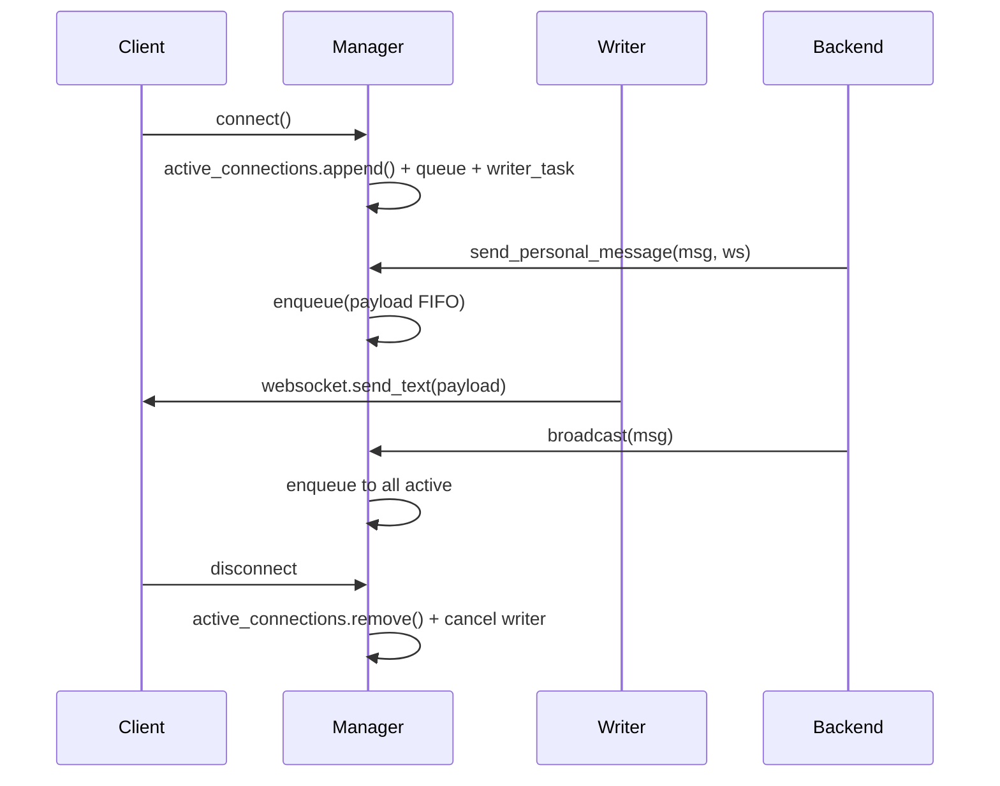

# 02 - WebSocket Manager

> **Estado:** ✅ Modularizado  
> **Ubicación:** `backend/app/services/websocket_manager.py`  
> **Última actualización:** 2026-04-20
> **Changelog:** `docs/changelog/02-websocket-manager.md`

---

## Propósito

Gestionar conexiones WebSocket con:
- Registro/desregistro de clientes
- Envío de mensajes individuales y broadcast
- Serialización FIFO saliente por conexión mediante cola dedicada + writer task único
- Manejo robusto de errores y desconexiones
- Métricas de conexiones
- Normalización JSON-safe de payloads salientes para evitar `NaN`/`Infinity` incompatibles con `JSON.parse`
- Política `Protect notebooks` ante saturación del transporte compartido (`/ws`)
- Separación física entre `/ws` shell-global y `/ws/notebook` mediante managers distintos

## Update 2026-04-20

- `websocket_manager.py` expone ahora `manager` y `notebook_manager`; cada `WebSocket` queda enlazado a su manager dueño en `connect()`.

- `send_personal_message()` y `disconnect()` delegan al manager enlazado del socket cuando el caller usa la instancia equivocada, evitando fugas de ruteo al introducir `/ws/notebook`.

- El resultado operativo es que la cola saliente que protege a notebook A ya no es la misma cola que protege al shell global o al notebook B.

---

## Archivos

| Archivo | Descripción |
|---------|-------------|
| `backend/app/services/websocket_manager.py` | Clase ConnectionManager e instancia global |
| `backend/main.py` | Importa y usa `manager` |
| `backend/app/contracts/ws_models.py` | Validación tipada aditiva de payloads WS críticos |
| `docs/tools/check_contract_sync.py` | Gate de sincronía runtime↔docs para contratos WS |

---

## Dependencias

### Internas
- Ninguna (módulo independiente)

### Externas
- `fastapi.WebSocket`
- `asyncio`

---

## API Pública

### Clase: ConnectionManager

```python
class ConnectionManager:
    """Gestor de conexiones WebSocket con manejo robusto de errores.
    
    Concurrencia: usa asyncio.Lock para proteger connect/disconnect
    y el mapa de estado por conexión. Cada websocket tiene una cola
    saliente FIFO propia y un único writer task autorizado a llamar
    websocket.send_text().
    """
    
    async def connect(self, websocket: WebSocket) -> None:
        """Acepta y registra una nueva conexión (protegido por asyncio.Lock)."""
    
    async def disconnect(self, websocket: WebSocket) -> None:
        """Elimina una conexión de forma segura (protegido por asyncio.Lock)."""
    
    async def send_personal_message(
        self, 
        message: dict, 
        websocket: WebSocket
    ) -> bool:
        """
        Encola un mensaje para un WebSocket específico.
        Sanitiza valores no finitos antes de serializar a JSON estricto.
        El retorno True significa "aceptado por la cola saliente", no
        "flush físico ya completado".
        
        Returns:
            True si el payload fue aceptado por la cola; False si la
            conexión ya estaba cerrándose o fue desconectada.
        """
    
    async def broadcast(self, message: dict) -> int:
        """
        Encola un mensaje para todas las conexiones activas.
        Serializa JSON una sola vez y lo empuja a la cola FIFO de cada
        conexión para evitar re-serialización O(n). También normaliza
        `NaN`/`Infinity` a `null` para compatibilidad browser↔backend.
        
        Returns:
            Número de conexiones que aceptaron el payload en su cola.
        """
    
    @property
    def connection_count(self) -> int:
        """Retorna el número de conexiones activas."""
    
    @property
    def total_connections(self) -> int:
        """Retorna el número total de conexiones desde el inicio."""
```

---

## Estructura Interna

```python
def __init__(self):
    self.active_connections: List[WebSocket] = []
    self._connection_count = 0  # Contador para métricas
    self._lock = asyncio.Lock()  # Protege connect/disconnect
    self._connection_states: dict[int, _ConnectionState] = {}
    self._outgoing_queue_maxsize = WS_OUTGOING_QUEUE_MAXSIZE
```

### Transporte saliente serializado por conexión

```python
@dataclass
class _ConnectionState:
    websocket: WebSocket
    queue: asyncio.Queue[tuple[str, float, int]]
    writer_task: Optional[asyncio.Task] = None
    closing: bool = False
```

- Cada conexión `/ws` mantiene su propia cola saliente FIFO.
- Solo `_writer_loop()` puede ejecutar `websocket.send_text()`.
- Productores distintos (`notebook_stream`, `notebook_progress_update`, `notebook_docx_update`, `notebook_pdf_ready`, etc.) ya no compiten directamente sobre el mismo socket.
- El orden de entrega se preserva por conexión, mientras conexiones distintas pueden drenar en paralelo.

### Serialización JSON estricta

- Antes de `json.dumps`, el manager recorre `dict`/`list`/`tuple`/`set` y reemplaza floats no finitos (`NaN`, `Infinity`, `-Infinity`) por `null`.
- El saneamiento se aplica tanto en `send_personal_message()` como en `broadcast()`.
- Esto evita que notebooks con outputs previos, `execution_states` o snapshots de variables con valores no finitos disparen `Error parsing websocket message` en el frontend.

---

## Flujo de Datos



---

## Manejo de Errores y Backpressure

### Política `Protect notebooks`

- La cola saliente compartida existe para que un notebook con pipeline DOCX/PDF o stream intenso no bloquee directamente a otro notebook sobre el mismo `/ws`.
- Si la cola FIFO de una conexión se satura, el manager no bloquea indefinidamente a los productores notebook/docx.
- En esa condición se registra saturación, se cierra la conexión con código `1013` y razón `outgoing_queue_saturated`, y se deja que el frontend reconecte limpio.
- La prioridad es proteger la ejecución notebook del wedge por transporte degradado, incluso si eso implica reciclar una conexión lenta.

```python
async def send_personal_message(self, message: dict, websocket: WebSocket) -> bool:
    try:
        payload = _serialize_ws_message(message)
        return await self._enqueue_serialized_payload(
            websocket=websocket,
            payload=payload,
            payload_bytes_len=len(payload.encode("utf-8")),
        )
    except RuntimeError:
        self.disconnect(websocket)
        return False
    except Exception as e:
        # Log error pero no propagar
        return False
```

---

## Configuración

| Constante | Valor | Descripción |
|-----------|-------|-------------|
| `WS_MAX_MESSAGE_SIZE` | 10MB | Tamaño máximo de mensaje |
| `WS_DEBUG_LOGGING` | `False` | Activar logs detallados |
| `WS_OUTGOING_QUEUE_MAXSIZE` | `128` | Profundidad máxima de la cola saliente FIFO por conexión |

| Variable de Entorno | Descripción |
|---------------------|-------------|
| `INSPYRO_WS_DEBUG` | Si `1`, activa logs de WebSocket |
| `INSPYRO_WS_OUTGOING_QUEUE_MAXSIZE` | Override de la profundidad máxima de la cola saliente por conexión |

---

## Uso desde main.py

```python
# backend/main.py
from app.services.websocket_manager import (
    manager,
    WS_MAX_MESSAGE_SIZE,
    _ws_log,
)

# En websocket_endpoint
await manager.connect(websocket)
await manager.send_personal_message(response, websocket)
```

### Validación de payload WS (aditiva)

Antes de enrutar handlers críticos, `main.py` valida payload según tipo de mensaje usando `app.contracts.ws_models`.

- Si el payload es inválido, el dispatcher responde:
  - `type: "error"`
  - `error_code: "invalid_message_payload"`
  - `details.message_type`
  - `details.validation_errors[]`
- No rompe compatibilidad: mensajes válidos mantienen flujo previo.

---

## Métricas

El manager expone métricas útiles para monitoreo:

```python
# Conexiones activas ahora
manager.connection_count

# Total de conexiones desde inicio
manager.total_connections
```

Además, `runtime_metrics` publica métricas agregadas del transporte saliente:

- `ws_outgoing_queue_depth_current`
- `ws_outgoing_queue_depth_max`
- `ws_outgoing_queue_maxsize`
- `ws_outgoing_queue_connections_backlogged`
- `ws_outgoing_queue_enqueued_total`
- `ws_outgoing_queue_dequeued_total`
- `ws_outgoing_queue_full_total`
- `ws_outgoing_queue_wait_p95_ms`

Estas métricas se exponen en `/metrics` y `/health`.

---

## Testing

```bash
# Aislamiento de send_text() por conexión, FIFO y saturación protect-notebooks
pytest backend/tests/test_websocket_manager.py -q

# Hardening del dispatcher WS principal (errores tipados, ping/pong, métricas)
pytest backend/tests/test_websocket_dispatcher_hardening.py -q

# Guard de sincronía runtime/docs para contratos WS
pytest backend/tests/test_contract_sync_guard.py -q
```

---

## Cambios Recientes

| Fecha | Cambio |
|-------|--------|
| 2026-04-19 | `ConnectionManager` incorpora cola saliente FIFO por conexión, writer task único, métricas de backpressure y cierre `1013/outgoing_queue_saturated` para proteger notebooks cuando el transporte compartido se degrada |
| 2026-02-10 | `ConnectionManager` protegido con `asyncio.Lock` para `connect`/`disconnect`; `broadcast()` serializa JSON una sola vez |
| 2026-02-09 | Dispatcher `/ws` prioriza control plane (`interrupt/reset/shutdown/cancel`) y limita fan-out de tareas pesadas por conexión |
| 2026-02-07 | `main.py` migra a `manager.connect()` y expone métricas WS en `/health` y `/metrics` |
| 2025-12 | Agregado contador de métricas |
| 2025-11 | Manejo robusto de desconexiones |
