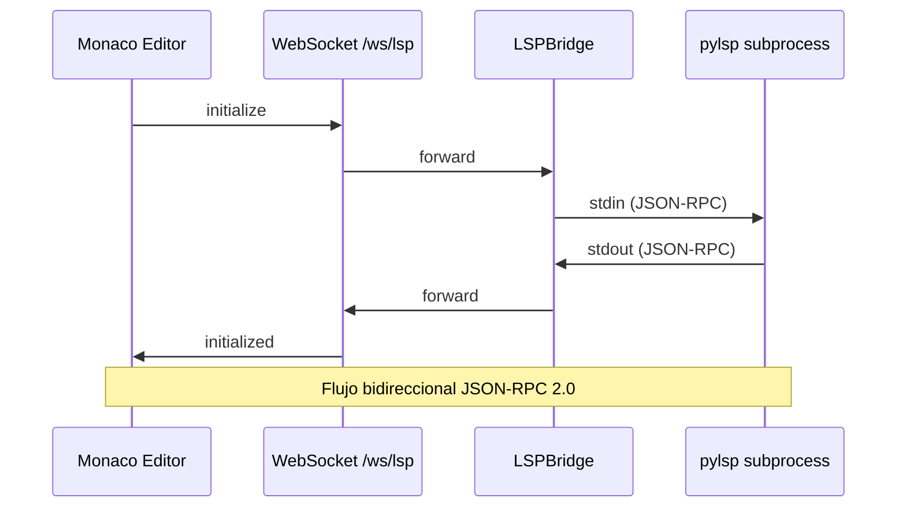

# 08 - LSP Bridge

> **Estado:** ✅ Modularizado  
> **Servicio:** `backend/app/services/lsp_bridge.py`  
> **Endpoint:** `backend/app/routers/lsp.py` (74 líneas)
> **Última actualización:** 2026-03-29
> **Changelog:** `docs/changelog/08-lsp-bridge.md`

---

## Propósito

Conectar el editor Monaco con el Python Language Server (pylsp):
- Autocompletado inteligente
- Hover con documentación
- Diagnósticos (errores, warnings)
- Go to definition
- Find references

---

## Archivos

| Archivo | Líneas | Descripción |
|---------|--------|-------------|
| `backend/app/services/lsp_bridge.py` | ~280 | Clase LSPBridge |
| `backend/app/routers/lsp.py` | 74 | Endpoint WebSocket `/ws/lsp` |
| `backend/stubs/` | - | Type stubs para APIs custom |

---

## Dependencias

### Internas
- Ninguna (módulo independiente)

### Externas
- `pylsp` - Python Language Server
- `subprocess` - Para ejecutar pylsp

---

## Arquitectura



---

## LSPBridge Class

```python
class LSPBridge:
    """Puente entre WebSocket y proceso pylsp."""
    
    def __init__(self):
        self._process: Optional[subprocess.Popen] = None
        self._reader_task: Optional[asyncio.Task] = None
    
    async def start(self, on_message: Callable[[dict], Awaitable[None]]):
        """
        Inicia el proceso pylsp y el reader de stdout.
        
        Args:
            on_message: Callback para mensajes del LSP
        """
    
    async def send(self, message: dict):
        """Envía un mensaje JSON-RPC a pylsp."""
    
    async def stop(self):
        """Detiene el proceso pylsp."""
```

---

## Configuración de pylsp

```python
# Comando para iniciar pylsp
PYLSP_COMMAND = ["pylsp", "--log-file", "./logs/pylsp.log"]

# Configuración enviada desde el frontend
{
    "pylsp": {
        "plugins": {
            "jedi": {
                "extra_paths": [
                    "./backend/stubs",  # Type stubs
                    "./backend/librerias_propias"  # APIs custom
                ]
            },
            "pyflakes": {"enabled": True},
            "pylint": {"enabled": False},
            "autopep8": {"enabled": False}
        }
    }
}
```

---

## Type Stubs

Para que el LSP reconozca APIs inyectadas en runtime, se crean stubs:

```python
# backend/stubs/docx_api.pyi

from typing import Any, Optional, List

def build_doc(
    order: int = 0,
    *,
    strict: bool = False
) -> "DocBuilder":
    """
    Context manager para construir bloques DOCX.
    
    Args:
        order: Posición del bloque en el documento final
        strict: Si True, errores lanzan excepciones
    """
    ...

class DocBuilder:
    def heading(self, text: str, *, level: int = 1) -> "DocBuilder": ...
    def text(self, text: str, *, style: Optional[str] = None) -> "DocBuilder": ...
    def math(self, expression: str) -> "DocBuilder": ...
    def math_latex(self, expression: str) -> "DocBuilder": ...
    def create_math_latex_element(self, expression: str): ...
    def table(self, data: Any) -> "DocBuilder": ...
    def figure(self, fig: Any, *, caption: str = "") -> "DocBuilder": ...
```

---

## Endpoint WebSocket

```python
@app.websocket("/ws/lsp")
async def lsp_websocket_endpoint(websocket: WebSocket):
    await websocket.accept()
    
    bridge = LSPBridge()
    
    async def forward_to_client(msg: dict):
        await websocket.send_json(msg)
    
    await bridge.start(on_message=forward_to_client)
    
    try:
        while True:
            data = await websocket.receive_json()
            await bridge.send(data)
    except WebSocketDisconnect:
        pass
    finally:
        await bridge.stop()
```

---

## Mensajes JSON-RPC

### Inicialización

```javascript
// Cliente → Server
{
    "jsonrpc": "2.0",
    "id": 1,
    "method": "initialize",
    "params": {
        "rootUri": "file:///./",
        "capabilities": {...}
    }
}

// Server → Cliente
{
    "jsonrpc": "2.0",
    "id": 1,
    "result": {
        "capabilities": {
            "completionProvider": {...},
            "hoverProvider": true,
            "definitionProvider": true
        }
    }
}
```

### Autocompletado

```javascript
// Cliente → Server
{
    "jsonrpc": "2.0",
    "id": 2,
    "method": "textDocument/completion",
    "params": {
        "textDocument": {"uri": "file:///./relative/path/file.py"},
        "position": {"line": 10, "character": 5}
    }
}

// Server → Cliente
{
    "jsonrpc": "2.0",
    "id": 2,
    "result": {
        "items": [
            {"label": "print", "kind": 3, "detail": "builtin function"},
            {"label": "pandas", "kind": 9, "detail": "module"}
        ]
    }
}
```

---

## Implementación Actual

```python
# backend/app/routers/lsp.py

@router.websocket("/ws/lsp")
async def lsp_websocket_endpoint(websocket: WebSocket):
    if not _lsp_available:
        await websocket.close(code=1003, reason="LSP no disponible")
        return

    await websocket.accept()
    bridge = LSPBridge()
    if not await bridge.start():
        await websocket.close(code=1011, reason="No se pudo iniciar pylsp")
        return

    await bridge.configure()
    await bridge.start_forwarding(forward_to_client)
```

### Estrategia de proceso en Windows

- El bridge usa `subprocess.Popen` para lanzar `pylsp` en vez de `asyncio.create_subprocess_exec`.
- La razón es compatibilidad con Windows: bajo ciertos arranques de uvicorn/reload, el event loop selector no soporta subprocess transport y lanza `NotImplementedError`.
- La E/S bloqueante de `stdin`/`stdout`/`stderr` se encapsula con `asyncio.to_thread`, manteniendo la API async del bridge sin depender del soporte de subprocess del loop.
- El arranque valida también salidas inmediatas del proceso para distinguir mejor entre "comando inexistente" y "pylsp arrancó y murió".

### Registro en main.py

```python
from app.routers.lsp import router as lsp_router
app.include_router(lsp_router)
```

---

## Troubleshooting

| Problema | Solución |
|----------|----------|
| LSP no reconoce API custom | Verificar stubs en `backend/stubs/` |
| Autocompletado lento | Revisar `extra_paths` para no incluir carpetas grandes |
| Errores de conexión | Verificar que `pylsp` arranque en el venv y que el bridge no esté corriendo sobre un loop selector sin fallback |

---

## Testing

```bash
# Cobertura actual asociada al flujo LSP/stubs
pytest backend/tests/test_units_lsp_stubs.py -q
```

No existe una suite dedicada `test_lsp_bridge.py` al 2026-02-22; la validación funcional del puente se realiza principalmente por smoke E2E en editor.

---

## Cambios Recientes

| Fecha | Cambio |
|-------|--------|
| 2026-03-15 | `LSPBridge` migra a `subprocess.Popen` + `asyncio.to_thread` para evitar fallos de arranque de `pylsp` en Windows con event loop selector |
| 2025-12 | Agregados stubs para DOCX API |
| 2025-11 | Configuración de extra_paths |
