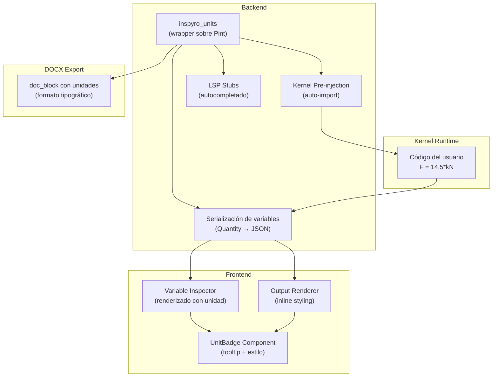

# 18 - Engineering Units (Unidades de Ingeniería)

> **Estado:** ✅ Completado (Fases 1 a 8)
> **Ubicación:** `backend/librerias_propias/inspyro_units/` + `backend/app/routers/units.py` + `frontend/src/components/notebook/`
> **Última actualización:** 2026-03-07
> **Changelog:** `docs/changelog/18-engineering-units.md`

---

## Propósito sistémico

Proveer soporte nativo de **unidades de ingeniería y ciencias** en todo el pipeline de Inspyro: desde la escritura de código Python en el editor, pasando por la ejecución en el kernel Jupyter, hasta la visualización estilizada en el frontend y la exportación DOCX/PDF.

La funcionalidad permite al usuario escribir expresiones como `14.5*kN`, `25*MPa`, `3.2*m/s²` directamente en celdas de código, obteniendo:

1. **Backend:** aritmética dimensional correcta (validación física automática)
2. **Frontend:** renderizado estilizado de unidades (cursiva + color azul claro + tooltip informativo)
3. **DOCX:** exportación con formato tipográfico correcto (superíndices, subíndices, cursiva)

---

## Arquitectura general



---

## Librería base: Pint

Se utiliza [Pint](https://pint.readthedocs.io/) como motor de cálculo dimensional. Pint aporta:

- Registro completo de unidades SI, CGS, imperiales y de ingeniería
- Prefijos automáticos (`kilo`, `mega`, `milli`, etc.)
- Aritmética dimensional con validación (sumar `kN` + `kg` → error)
- Conversión entre unidades (`.to('MPa')`, `.to('psi')`)
- Formateo LaTeX nativo (`.format_babel()`, `{:~L}`)
- Integración con NumPy y Pandas
- Cero dependencias externas en su core

### ¿Por qué un wrapper y no Pint directo?

Pint es potente pero verboso para uso interactivo de ingeniería:

```python
# Pint puro (verbose):
import pint
ureg = pint.UnitRegistry()
F = 14.5 * ureg.kilonewton
sigma = 25 * ureg.megapascal

# Inspyro wrapper (natural):
F = 14.5*kN
sigma = 25*MPa
v = 3.2*m/s**2
```

El wrapper `inspyro_units` expone todas las unidades comunes como **constantes globales** con nombres estándar de ingeniería, sin necesidad de registros ni imports explícitos.

## Ajustes recientes de compatibilidad dimensional

1. La compatibilidad entre unidades ya no depende de `str(quantity.dimensionality)`, porque Pint no garantiza un orden estable en esa serialización.
2. `normalization.py` canoniza la firma dimensional antes de comparar o exponer `compatible_units`, evitando falsos negativos entre fuerzas SI e imperiales como `N`, `kN`, `lbf`, `kgf` y `tonf`.
3. `/api/units/convert` y `/api/units/compatible` ahora exponen una dimensión canónica coherente con la identidad normalizada de la unidad de salida.

---

## Plan de implementación por fases

> [!IMPORTANT]
> Este plan está diseñado para ser abordado en **múltiples sesiones** por **distintos agentes de IA**. Cada fase es auto-contenida y tiene criterios de verificación claros. Las fases deben ejecutarse en orden (cada una requiere la anterior).

---

### Fase 1: Backend — Librería `inspyro_units` ✅

> **Estado:** Completada el 2026-02-11. Ver changelog para detalles.

**Objetivo:** Crear el paquete Python que envuelve Pint con una API ergonómica para ingeniería.

**Sesiones estimadas:** 1–2

#### Archivos a crear

| Archivo | Descripción |
|---------|-------------|
| `backend/librerias_propias/inspyro_units/__init__.py` | Exporta API pública completa |
| `backend/librerias_propias/inspyro_units/registry.py` | `UnitRegistry` configurado + singleton |
| `backend/librerias_propias/inspyro_units/constants.py` | Constantes globales: `kN`, `MPa`, `kg`, `m`, `s`, etc. |
| `backend/librerias_propias/inspyro_units/formatting.py` | Formateo elegante: LaTeX, Unicode, HTML, DOCX |
| `backend/librerias_propias/inspyro_units/serialization.py` | `Quantity` → dict JSON para WS |
| `backend/librerias_propias/inspyro_units/metadata.py` | Catálogo de metadata por unidad (descripción, categoría, dimensión, símbolo) |
| `backend/librerias_propias/inspyro_units/compat.py` | Compatibilidad NumPy/Pandas (ufuncs, wrapping) |

#### Detalle técnico

##### 1.1 Registry singleton (`registry.py`)

```python
import pint

# Singleton para toda la aplicación
_ureg = pint.UnitRegistry()
_ureg.default_format = "~P"  # formato compacto/pretty por defecto
Q_ = _ureg.Quantity

def get_registry():
    return _ureg
```

##### 1.2 Constantes globales (`constants.py`)

Exportar **todas las unidades comunes de ingeniería** como constantes de módulo. El usuario solo necesita `from inspyro_units import *` (o el auto-import del kernel).

```python
from .registry import _ureg, Q_

# ═══════════════════════════════════════════
# LONGITUD
# ═══════════════════════════════════════════
mm = _ureg.millimeter
cm = _ureg.centimeter
m  = _ureg.meter
km = _ureg.kilometer
inch = _ureg.inch  # pulgada
ft = _ureg.foot    # pie

# ═══════════════════════════════════════════
# MASA
# ═══════════════════════════════════════════
g  = _ureg.gram
kg = _ureg.kilogram
ton = _ureg.metric_ton  # tonelada métrica
lb = _ureg.pound        # libra

# ═══════════════════════════════════════════
# TIEMPO
# ═══════════════════════════════════════════
s      = _ureg.second
minute = _ureg.minute
hr     = _ureg.hour

# ═══════════════════════════════════════════
# FUERZA
# ═══════════════════════════════════════════
N   = _ureg.newton
kN  = _ureg.kilonewton
MN  = _ureg.meganewton
lbf  = _ureg.force_pound
kgf  = _ureg.kilogram_force
tonf = _ureg.metric_ton_force  # tonelada fuerza métrica = 1000 kgf

# ═══════════════════════════════════════════
# PRESIÓN / ESFUERZO
# ═══════════════════════════════════════════
Pa  = _ureg.pascal
kPa = _ureg.kilopascal
MPa = _ureg.megapascal
GPa = _ureg.gigapascal
bar = _ureg.bar
atm = _ureg.atmosphere
psi = _ureg.psi

# ═══════════════════════════════════════════
# ENERGÍA / TRABAJO
# ═══════════════════════════════════════════
J   = _ureg.joule
kJ  = _ureg.kilojoule
MJ  = _ureg.megajoule
cal = _ureg.calorie
kcal = _ureg.kilocalorie
Wh  = _ureg.watt_hour
kWh = _ureg.kilowatt_hour

# ═══════════════════════════════════════════
# POTENCIA
# ═══════════════════════════════════════════
W   = _ureg.watt
kW  = _ureg.kilowatt
MW  = _ureg.megawatt
hp  = _ureg.horsepower

# ═══════════════════════════════════════════
# TEMPERATURA
# ═══════════════════════════════════════════
K     = _ureg.kelvin
degC  = _ureg.degC         # grado Celsius
degF  = _ureg.degF         # grado Fahrenheit

# ═══════════════════════════════════════════
# ÁNGULO
# ═══════════════════════════════════════════
rad = _ureg.radian
deg = _ureg.degree

# ═══════════════════════════════════════════
# VELOCIDAD (composiciones comunes)
# ═══════════════════════════════════════════
# Se crean naturalmente: 5*m/s, 120*km/minute, etc.

# ═══════════════════════════════════════════
# MOMENTO / TORQUE
# ═══════════════════════════════════════════
Nm  = _ureg.newton * _ureg.meter     # newton-metro
kNm = _ureg.kilonewton * _ureg.meter

# ═══════════════════════════════════════════
# ÁREA / VOLUMEN (composiciones comunes)
# ═══════════════════════════════════════════
# Se crean naturalmente: 5*m**2, 3*cm**3, etc.

# ═══════════════════════════════════════════
# DENSIDAD, VISCOSIDAD (composiciones comunes)
# ═══════════════════════════════════════════
# Se crean naturalmente: 7850*kg/m**3, etc.

# ═══════════════════════════════════════════
# ELECTRICIDAD
# ═══════════════════════════════════════════
A   = _ureg.ampere
V   = _ureg.volt
ohm = _ureg.ohm
F_  = _ureg.farad  # F colisiona con fuerza si se usa como variable
Hz  = _ureg.hertz

# ═══════════════════════════════════════════
# FRECUENCIA
# ═══════════════════════════════════════════
# Hz ya definido arriba
rpm = _ureg.revolution / _ureg.minute

# ═══════════════════════════════════════════
# INERCIA / SECCIÓN (ingeniería estructural)
# ═══════════════════════════════════════════
# Se crean naturalmente: 1500*cm**4, 200*cm**3, etc.
```

> [!NOTE]
> Las unidades compuestas (velocidad, densidad, momento de inercia) se forman **naturalmente** con operadores aritméticos: `5*m/s`, `2500*kg/m**3`, `1200*cm**4`. No requieren constantes explícitas.

##### 1.3 Metadata de unidades (`metadata.py`)

Catálogo que el frontend usa para tooltips y el DOCX para anotaciones:

```python
UNIT_METADATA = {
    "meter": {
        "symbol": "m",
        "category": "Longitud",
        "dimension": "[length]",
        "description": "Metro — unidad SI de longitud",
        "si_base": True,
    },
    "kilonewton": {
        "symbol": "kN",
        "category": "Fuerza",
        "dimension": "[force]",
        "description": "Kilonewton — 1000 newtons",
        "si_base": False,
        "equivalent": "1 kN = 1000 N = 101.97 kgf",
    },
    "megapascal": {
        "symbol": "MPa",
        "category": "Presión / Esfuerzo",
        "dimension": "[pressure]",
        "description": "Megapascal — 10⁶ Pa, unidad común en ingeniería estructural",
        "si_base": False,
        "equivalent": "1 MPa = 1 N/mm² = 145.04 psi",
    },
    "metric_ton_force": {
        "symbol": "tonf",
        "category": "Fuerza",
        "dimension": "[force]",
        "description": "Tonelada-fuerza métrica — 1000 kgf = 9806.65 N",
        "si_base": False,
        "equivalent": "1 tonf = 1000 kgf = 9.80665 kN",
    },
    # ... (catálogo completo para todas las unidades exportadas)
}
```

##### 1.4 Serialización (`serialization.py`)

Convierte `pint.Quantity` a un dict JSON serializable para enviar por WebSocket:

```python
def serialize_quantity(q):
    """Serializa una pint.Quantity para transporte WS."""
    return {
        "type": "Quantity",
        "magnitude": float(q.magnitude),
        "unit": f"{q.units:~P}",           # formato compacto: "kN", "MPa"
        "unit_full": f"{q.units:P}",        # formato largo: "kilonewton"
        "unit_latex": f"{q.units:~L}",      # formato LaTeX: "\\mathrm{kN}"
        "unit_html": f"{q.units:~H}",       # formato HTML
        "dimensionality": str(q.dimensionality),  # "[length] * [mass] / [time] ** 2"
        "is_quantity": True,
        "repr": f"{q:~P}",                 # "14.5 kN"
        "category": _get_category(q),       # "Fuerza"
        "metadata": _get_metadata(q),       # dict con descripción, equivalencias
    }
```

##### 1.5 Formateo elegante (`formatting.py`)

```python
def format_quantity_latex(q):
    """Formatea para renderizado LaTeX en el notebook."""
    mag = q.magnitude
    unit_latex = f"{q.units:~L}"
    return f"{mag}\\;{unit_latex}"

def format_quantity_unicode(q):
    """Formatea para display text con Unicode (superíndices, etc.)."""
    return f"{q:~P}"

def format_quantity_docx(q):
    """Retorna estructura para doc_block DOCX con formato tipográfico."""
    return {
        "magnitude": q.magnitude,
        "unit_runs": _build_docx_runs(q.units),  # runs con italic, superscript
    }
```

#### Verificación Fase 1

```python
# backend/tests/test_inspyro_units.py
import pytest
from librerias_propias.inspyro_units import *

def test_basic_quantity():
    F = 14.5*kN
    assert abs(F.magnitude - 14.5) < 1e-10
    assert str(F.units) == "kilonewton"

def test_unit_arithmetic():
    """Suma compatible: OK."""
    F1 = 10*kN
    F2 = 5000*N
    R = F1 + F2
    assert abs(R.to(kN).magnitude - 15.0) < 1e-10

def test_incompatible_units_error():
    """Suma incompatible: error."""
    with pytest.raises(pint.DimensionalityError):
        _ = 10*kN + 5*kg

def test_unit_conversion():
    p = 1*MPa
    p_psi = p.to(psi)
    assert abs(p_psi.magnitude - 145.038) < 0.01

def test_serialization():
    from librerias_propias.inspyro_units.serialization import serialize_quantity
    F = 14.5*kN
    data = serialize_quantity(F)
    assert data["type"] == "Quantity"
    assert data["is_quantity"] is True
    assert data["unit"] == "kN"
    assert data["category"] == "Fuerza"

def test_compound_units():
    """Unidades compuestas se forman con operadores."""
    v = 120*km/hr
    rho = 2500*kg/m**3
    assert v.dimensionality == {'[length]': 1, '[time]': -1}

def test_metadata_lookup():
    from librerias_propias.inspyro_units.metadata import UNIT_METADATA
    assert "kilonewton" in UNIT_METADATA
    assert UNIT_METADATA["kilonewton"]["category"] == "Fuerza"

def test_temperature():
    """Temperaturas con offset se manejan correctamente."""
    T = Q_(25, degC)
    T_K = T.to(K)
    assert abs(T_K.magnitude - 298.15) < 0.01
```

**Comando de ejecución:**

```powershell
cd c:\CalcPyro\P1
.\venv_inspyro\Scripts\activate
pytest backend/tests/test_inspyro_units.py -v
```

---

### Fase 2: Backend — Integración con kernel Jupyter

> **Estado:** ✅ Completada el 2026-02-11.

**Objetivo:** Hacer que `inspyro_units` esté disponible automáticamente en cada celda del notebook sin import explícito.

**Sesiones estimadas:** 1

**Dependencia:** Fase 1 completada.

#### Archivos a modificar

| Archivo | Cambio |
|---------|--------|
| `backend/app/services/notebook_service.py` | Agregar preamble de units al código instrumentado |
| `backend/app/services/notebook_service.py` | Capturar variables por ejecución para enviarlas a frontend (`Quantity` incluida) |
| `backend/app/services/jupyter_kernel.py` | Extender serialización de variables para reconocer `pint.Quantity` |
| `backend/tests/test_units_kernel_integration.py` | Tests de preámbulo + integración kernel/serialización |

#### Detalle técnico

##### 2.1 Preamble de unidades en `_build_notebook_instrumented_code`

Añadir un bloque de pre-inyección **antes** del preámbulo DOCX existente, que haga disponibles todas las unidades en el namespace del kernel:

```python
# En _build_notebook_instrumented_code(), agregar al inicio:
units_preamble = textwrap.dedent(f"""# --- UNITS PREAMBULO ---
import sys as __sys
__UNITS_BR={_BACKEND_ROOT!r}
if __UNITS_BR not in __sys.path: __sys.path.insert(0, __UNITS_BR)
if not globals().get('__INSP_UNITS_READY__', False):
    try:
        __INSP_UNITS_BEFORE = set(globals().keys())
        from librerias_propias.inspyro_units import *
        import librerias_propias.inspyro_units as u
        from librerias_propias.inspyro_units.serialization import serialize_quantity as __serialize_quantity
        __INSP_UNITS_AFTER = set(globals().keys())
        __INSP_UNITS_IMPORTED_NAMES = frozenset(__INSP_UNITS_AFTER - __INSP_UNITS_BEFORE)
        __INSP_UNITS_IMPORTED_IDS = {
            name: id(globals().get(name))
            for name in __INSP_UNITS_IMPORTED_NAMES
            if name in globals()
        }
        __UNITS_IMPORT_ERROR = None
        __INSP_UNITS_READY__ = True
    except Exception as __units_err:
        __UNITS_IMPORT_ERROR = __units_err
        __INSP_UNITS_IMPORTED_NAMES = frozenset()
        __INSP_UNITS_IMPORTED_IDS = {}
        __INSP_UNITS_READY__ = False
else:
    __UNITS_IMPORT_ERROR = None
    if '__INSP_UNITS_IMPORTED_NAMES' not in globals():
        __INSP_UNITS_IMPORTED_NAMES = frozenset()
    if '__INSP_UNITS_IMPORTED_IDS' not in globals():
        __INSP_UNITS_IMPORTED_IDS = {}
    if 'u' not in globals():
        try:
            import librerias_propias.inspyro_units as u
        except Exception:
            pass
# --- FIN UNITS PREAMBULO ---
""")
```

> [!IMPORTANT]
> El sentinel `__INSP_UNITS_READY__` evita re-importar en cada ejecución de celda, manteniendo el rendimiento.
> Además, `__INSP_UNITS_IMPORTED_IDS` permite excluir constantes de unidad autoimportadas del `variables_summary` (solo quedan variables definidas por el usuario), preservando overrides explícitos cuando el usuario reasigna nombres como `kN`.

##### 2.2 Serialización de variables con unidades

La serialización se realiza en `jupyter_kernel.py` durante `_capture_variables_summary`, detectando `pint.Quantity` y usando `serialize_quantity`:

```python
def _insp_try_serialize_quantity(value):
    if not (hasattr(value, "magnitude") and hasattr(value, "units")):
        return None
    serializer = globals().get("__serialize_quantity")
    if callable(serializer):
        return serializer(value)
    from librerias_propias.inspyro_units.serialization import serialize_quantity
    return serialize_quantity(value)

def _insp_conv(value):
    quantity_payload = _insp_try_serialize_quantity(value)
    if quantity_payload is not None:
        return quantity_payload
    # ... resto de serialización existente (numpy/pandas/primitivos)
```

También se filtran símbolos de unidades autoimportadas del resumen:

```python
def _insp_is_user_var(name, value):
    imported_ids = globals().get("__INSP_UNITS_IMPORTED_IDS", {})
    if name in imported_ids and id(value) == imported_ids.get(name):
        return False
    # ... filtros existentes
    return True
```

Adicionalmente, la lectura de `user_expressions` en `_capture_variables_summary` usa decodificación defensiva (`_extract_ue_text` + fallback de parseo JSON) para evitar que payloads quoted con escapes de `repr(...)` vacíen `variables_summary`.
También se depuran internals de IPython/kernel (`_i`, `_ip`, `_np_to_native`, `exit`, `quit`, `__INSP_*`) para que el panel de variables reciba solo estado de usuario.

#### Verificación Fase 2

**Test automatizado:**

```python
# backend/tests/test_units_kernel_integration.py
import pytest

def test_units_preamble_injection():
    """Verificar que el preamble de unidades se genera correctamente."""
    from app.services.notebook_service import _build_notebook_instrumented_code
    code = _build_notebook_instrumented_code(
        source_code="F = 14.5*kN",
        cell_id="test_cell",
        cell_index=0,
        emit_docx=False,
    )
    assert "inspyro_units" in code
    assert "kN" in code  # guard check

def test_quantity_in_variables_summary():
    """Verificar Quantity en variables_summary (integración)."""
    # marcado `integration`; valida type="Quantity", unit="kN"
    # y ausencia de constantes autoimportadas / internals ("kN", "MPa", "__serialize_quantity", "_ih")

def test_user_override_of_imported_unit_name_is_not_filtered():
    """Verificar que `kN = 1*kg` se conserva como variable del usuario."""
    # marcado `integration`; valida que el filtro por `__INSP_UNITS_IMPORTED_IDS`
    # excluye solo símbolos inyectados originales, no overrides del usuario
```

**Test manual:**

1. Iniciar Inspyro con `.\restart_inspyro.ps1`
2. Crear un notebook nuevo
3. En una celda, escribir: `F = 14.5*kN`
4. Ejecutar la celda
5. Verificar que en el panel de variables aparece `F` con valor `14.5 kN` y tipo `Quantity`
6. En otra celda, escribir: `print(F + 5000*N)` → debe mostrar `19.5 kN`
7. En otra celda, escribir: `print(F + 5*kg)` → debe mostrar `DimensionalityError`

---

### Fase 3: Backend — Stubs LSP para autocompletado

**Objetivo:** Que Monaco/LSP autocomplete las unidades (`kN`, `MPa`, etc.) y muestre docstrings al hacer hover.

**Sesiones estimadas:** 1

**Dependencia:** Fase 1 completada.

> **Estado:** ✅ Completada el 2026-02-11.

#### Archivos a crear/modificar

| Archivo | Cambio |
|---------|--------|
| `backend/stubs/inspyro_units.pyi` | [NEW] Stubs con type hints y docstrings |
| `backend/app/services/lsp_bridge.py` | Asegurar que `stubs/` incluye los nuevos stubs |

#### Detalle técnico

```python
# backend/stubs/inspyro_units.pyi
"""
Stubs de tipo para inspyro_units.
Proveen autocompletado y hover info en el editor Monaco.
"""
from pint import Quantity, Unit

# Longitud
mm: Unit
"""Milímetro (mm) — 0.001 metros"""
cm: Unit
"""Centímetro (cm) — 0.01 metros"""
m: Unit
"""Metro (m) — unidad SI de longitud"""
km: Unit
"""Kilómetro (km) — 1000 metros"""

# Fuerza
N: Unit
"""Newton (N) — unidad SI de fuerza: 1 N = 1 kg·m/s²"""
kN: Unit
"""Kilonewton (kN) — 1000 newtons"""
MN: Unit
"""Meganewton (MN) — 10⁶ newtons"""

# Presión / Esfuerzo
Pa: Unit
"""Pascal (Pa) — unidad SI de presión: 1 Pa = 1 N/m²"""
kPa: Unit
"""Kilopascal (kPa) — 1000 pascales"""
MPa: Unit
"""Megapascal (MPa) — 10⁶ Pa = 1 N/mm²"""
GPa: Unit
"""Gigapascal (GPa) — 10⁹ Pa"""

# Masa
g: Unit
"""Gramo (g) — 0.001 kg"""
kg: Unit
"""Kilogramo (kg) — unidad SI de masa"""
ton: Unit
"""Tonelada métrica (t) — 1000 kg"""

# ... (completar para todas las unidades exportadas)

def Q_(magnitude: float, unit: Unit) -> Quantity:
    """Crea una Quantity: Q_(25, degC) → 25 °C"""
    ...
```

#### Verificación Fase 3

**Test manual:**

1. Abrir Inspyro, crear celda en notebook
2. Escribir `k` → verificar que aparece `kN`, `kPa`, `kW`, `kg`, `kcal`, etc.
3. Escribir `MP` → verificar que aparece `MPa`
4. Hacer hover sobre `kN` en el editor → verificar que muestra docstring "Kilonewton (kN) — 1000 newtons"
5. Escribir `F = 14.5*kN` luego `F.` → verificar que aparecen métodos `.to()`, `.magnitude`, `.units`

---

### Fase 4: Frontend — Componente `UnitBadge` y estilos

> **Estado:** ✅ Completada el 2026-02-12.

**Objetivo:** Crear el componente React que renderiza unidades con estilo visual (cursiva + azul claro + tooltip).

**Sesiones estimadas:** 1–2

**Dependencia:** Fase 2 completada (para que el JSON de variables incluya datos de unidades).

#### Archivos a crear

| Archivo | Descripción |
|---------|-------------|
| `frontend/src/components/notebook/UnitBadge.js` | [NEW] Componente React para renderizar una unidad |
| `frontend/src/components/notebook/UnitBadge.css` | [NEW] Estilos del badge |
| `frontend/src/components/notebook/UnitTooltip.js` | [NEW] Tooltip informativo de unidad |

#### Archivos a modificar

| Archivo | Cambio |
|---------|--------|
| `frontend/src/components/OutputRenderer.js` | Detectar y renderizar unidades en outputs |
| `frontend/src/components/notebook/deriveEngineeringVars.js` | Extender para parsear variables con unidades |
| `frontend/src/components/NotebookEditor.css` | Agregar estilos CSS para unidades |

#### Detalle técnico

##### 4.1 Componente `UnitBadge`

```jsx
// UnitBadge.js
import React, { useState } from 'react';
import UnitTooltip from './UnitTooltip';
import './UnitBadge.css';

/**
 * Renderiza una unidad de ingeniería con estilo visual.
 *
 * @param {string} unit - Símbolo corto: "kN", "MPa", "m/s²"
 * @param {number} magnitude - Valor numérico
 * @param {object} metadata - Metadata de la unidad (categoría, descripción, etc.)
 * @param {string} format - "inline" | "badge" | "full"
 */
export default function UnitBadge({ unit, magnitude, metadata, format = 'inline' }) {
    const [showTooltip, setShowTooltip] = useState(false);

    return (
        <span
            className={`unit-badge unit-badge--${format}`}
            onMouseEnter={() => setShowTooltip(true)}
            onMouseLeave={() => setShowTooltip(false)}
        >
            <span className="unit-badge__magnitude">{magnitude}</span>
            {' '}
            <span className="unit-badge__unit">{unit}</span>
            {showTooltip && metadata && (
                <UnitTooltip metadata={metadata} />
            )}
        </span>
    );
}
```

##### 4.2 Estilos CSS

```css
/* UnitBadge.css */

/* ─── Unidad inline en outputs ─── */
.unit-badge__unit {
    font-style: italic;
    color: #64b5f6;              /* azul claro Material Blue 300 */
    cursor: help;
    position: relative;
    transition: color 0.15s ease;
}

.unit-badge__unit:hover {
    color: #90caf9;              /* azul más claro al hover */
    text-decoration: underline dotted;
}

.unit-badge__magnitude {
    color: inherit;              /* hereda color del contexto */
    font-variant-numeric: tabular-nums;
}

/* ─── Tooltip ─── */
.unit-tooltip {
    position: absolute;
    bottom: calc(100% + 8px);
    left: 50%;
    transform: translateX(-50%);
    background: #1e1e2e;         /* dark background */
    border: 1px solid #3a3a5c;
    border-radius: 8px;
    padding: 10px 14px;
    min-width: 220px;
    max-width: 320px;
    z-index: 1000;
    box-shadow: 0 4px 20px rgba(0, 0, 0, 0.4);
    animation: unitTooltipFadeIn 0.15s ease;
    pointer-events: none;
}

.unit-tooltip__category {
    font-size: 10px;
    text-transform: uppercase;
    letter-spacing: 0.05em;
    color: #64b5f6;
    margin-bottom: 4px;
}

.unit-tooltip__name {
    font-size: 13px;
    font-weight: 600;
    color: #e0e0e0;
    margin-bottom: 2px;
}

.unit-tooltip__description {
    font-size: 11px;
    color: #9e9e9e;
    line-height: 1.4;
}

.unit-tooltip__equivalent {
    font-size: 11px;
    color: #b0bec5;
    margin-top: 6px;
    padding-top: 6px;
    border-top: 1px solid #2a2a4a;
    font-family: 'JetBrains Mono', monospace;
}

.unit-tooltip__dimension {
    font-size: 10px;
    color: #7e57c2;
    margin-top: 4px;
}

@keyframes unitTooltipFadeIn {
    from { opacity: 0; transform: translateX(-50%) translateY(4px); }
    to   { opacity: 1; transform: translateX(-50%) translateY(0); }
}
```

##### 4.3 Tooltip component

```jsx
// UnitTooltip.js
export default function UnitTooltip({ metadata }) {
    if (!metadata) return null;
    return (
        <div className="unit-tooltip">
            <div className="unit-tooltip__category">{metadata.category}</div>
            <div className="unit-tooltip__name">{metadata.symbol}</div>
            <div className="unit-tooltip__description">{metadata.description}</div>
            {metadata.equivalent && (
                <div className="unit-tooltip__equivalent">{metadata.equivalent}</div>
            )}
            <div className="unit-tooltip__dimension">{metadata.dimension}</div>
        </div>
    );
}
```

##### 4.4 Integración en `OutputRenderer.js`

Detectar patrones de unidades en outputs de texto plano y reemplazarlos con `UnitBadge`:

```javascript
// En OutputRenderer.js, agregar detección de Quantity en text/plain
// Patrón: "14.5 kN", "25.0 MPa", "3.2 m/s²"
function renderWithUnits(text) {
    const UNIT_PATTERN = /(\d+\.?\d*)\s+(kN|MN|N|MPa|GPa|kPa|Pa|kg|g|ton|m|cm|mm|km|...)/g;
    // Reemplazar con spans estilizados
    // ...
}
```

> [!NOTE]
> La detección en outputs se hace por **doble señal**: (a) el JSON de variables incluye `is_quantity: true`, (b) regex de respaldo para outputs de texto plano.

##### 4.5 Integración en `deriveEngineeringVars.js`

Extender la función para reconocer variables de tipo `Quantity` en el `variables_summary`:

```javascript
// En deriveEngineeringVars.js, agregar al procesamiento:
// Si variables_summary[varName].type === "Quantity":
//   - Incluir como variable de ingeniería con metadata de unidad
//   - Marcar is_engineering_data = true
//   - Agregar unit_info para el panel de variables
```

#### Verificación Fase 4

**Test manual:**

1. Ejecutar celda con `F = 14.5*kN`
2. Verificar que el output muestra `14.5` en color normal y `kN` en **cursiva azul claro**
3. Posar el mouse sobre `kN` → debe aparecer tooltip con:
   - Categoría: "Fuerza"
   - Nombre: "kN"
   - Descripción: "Kilonewton — 1000 newtons"
   - Equivalencia: "1 kN = 1000 N = 101.97 kgf"
   - Dimensión: "[length] · [mass] / [time]²"
4. Verificar que en el panel de variables, `F` muestra el valor con unidad estilizada
5. Ejecutar celda con `print(F)` → verificar estilo en output stream

---

### Fase 5: Frontend — Decoración Monaco (syntax highlighting de unidades)

> **Estado:** ✅ Completada el 2026-02-12.

**Objetivo:** Que las unidades de ingeniería aparezcan con estilo especial directamente en el editor de código Monaco.

**Sesiones estimadas:** 1

**Dependencia:** Fase 1 completada (para tener la lista de unidades).

#### Archivos a crear/modificar

| Archivo | Cambio |
|---------|--------|
| `frontend/src/components/MonacoEditorLSP.js` | Agregar decoraciones para tokens de unidad |
| `frontend/src/components/notebook/unitTokens.js` | [NEW] Lista de tokens de unidades reconocidas + helpers |

#### Detalle técnico

##### 5.1 Decoraciones en Monaco

Usar la API de decoraciones de Monaco para resaltar tokens de unidades en el código:

```javascript
// unitTokens.js
export const UNIT_TOKENS = new Set([
    'mm', 'cm', 'm', 'km', 'inch', 'ft',
    'g', 'kg', 'ton', 'lb',
    's', 'minute', 'hr',
    'N', 'kN', 'MN', 'lbf', 'kgf', 'tonf',
    'Pa', 'kPa', 'MPa', 'GPa', 'bar', 'atm', 'psi',
    'J', 'kJ', 'MJ', 'cal', 'kcal', 'Wh', 'kWh',
    'W', 'kW', 'MW', 'hp',
    'K', 'degC', 'degF',
    'rad', 'deg',
    'A', 'V', 'ohm', 'Hz',
    'Nm', 'kNm', 'rpm',
    // ... completar
]);

/**
 * Detecta tokens de unidades en un texto de código.
 * Retorna array de {startColumn, endColumn, lineNumber, unit}.
 * Solo se detecta cuando el token aparece después de * o / con un número.
 * Patrón: \d+(\.\d+)?\s*\*\s*(UNIT_TOKEN)
 */
export function findUnitTokens(text) {
    // ...
}
```

##### 5.2 Aplicación de decoraciones

```javascript
// En MonacoEditorLSP.js, al cambiar contenido:
const decorations = findUnitTokens(editorContent).map(match => ({
    range: new monaco.Range(match.lineNumber, match.startColumn, match.lineNumber, match.endColumn),
    options: {
        inlineClassName: 'monaco-unit-token',
        hoverMessage: {
            value: `**${match.unit}** — ${getUnitDescription(match.unit)}`
        },
    },
}));
editor.deltaDecorations([], decorations);
```

##### 5.3 Estilos CSS para Monaco

```css
/* En NotebookEditor.css o App.css */
.monaco-unit-token {
    font-style: italic;
    color: #64b5f6 !important;   /* azul claro, igual que UnitBadge */
}
```

##### 5.4 Hardening no evidente (2026-02-19)

- `findUnitTokens()` ahora enmascara strings primero y luego calcula comentarios (`#`) sobre la línea enmascarada.
- Se agregó helper interno `maskStringLiterals()` que reemplaza el contenido por espacios para preservar columnas de Monaco.
- Se corrige el falso negativo `a = "#"; F = 14.5*kN` y se mantiene exclusión de unidades dentro de strings/comentarios.
- Cobertura dedicada: `frontend/src/components/notebook/unitTokens.test.js`.

#### Verificación Fase 5

**Test manual:**

1. En una celda del notebook, escribir: `F = 14.5*kN`
2. Verificar que `kN` aparece en **cursiva azul claro** directamente en el editor
3. Hacer hover sobre `kN` en el editor → verificar que muestra información
4. Escribir `sigma = 25*MPa` → verificar que `MPa` también tiene el estilo
5. Escribir `x = 5*k` (variable `k`, no unidad) → verificar que `k` NO se estiliza
6. Escribir `total = 5*km + 3*m` → verificar que `km` y `m` se estilizan

---

### Fase 6: Backend — Integración DOCX

> **Estado:** ✅ Completada el 2026-02-12.

**Objetivo cumplido:** render tipográfico agresivo de magnitud+unidad en DOCX con fallback seguro.

#### Archivos implementados

| Archivo | Cambio |
|---------|--------|
| `backend/librerias_propias/inspyro_units/formatting.py` | Helper público `build_docx_unit_runs()` con soporte para Unicode superscript y notación caret (`^` / `**`) |
| `backend/librerias_propias/docx_builder/builder.py` | `DocBuilder.text()` ahora detecta patrones `número + unidad`, aplica thin-space y renderiza runs mixtos (unidad en cursiva + exponentes en superíndice) |
| `backend/librerias_propias/docx_builder/builder.py` | Fallback defensivo: ante error de parsing, el texto se escribe plano sin romper export DOCX |

#### Verificación ejecutada

- `backend/tests/test_units_docx_rendering.py` (nuevo): validación de runs/XML para `m/s²`, `kg/m³`, `kN`, `MPa`, además de fallback seguro.

---

### Fase 7: Frontend — Panel de variables con unidades

> **Estado:** ✅ Completada el 2026-02-12.

**Objetivo cumplido:** pestaña `Variables` operativa con conversión rápida REST y grafo enriquecido por runtime `Quantity`.

#### Archivos implementados

| Archivo | Cambio |
|---------|--------|
| `frontend/src/components/VisualizationPanel.js` | Nueva vista/pestaña `Variables` y toggle colapsado |
| `frontend/src/components/notebook/QuantityVariablesPanel.js` | Lista de variables `Quantity` con tarjeta, icono de categoría, dimensión y dropdown de conversión |
| `frontend/src/components/notebook/QuantityVariablesPanel.css` | Estilos de tarjetas, estados y feedback por fila |
| `frontend/src/App.js` | Paso de `variables` hacia `VisualizationPanel` (modo code y notebook) |
| `frontend/src/components/dependency-graph/utils.js` | `formatRuntimeValue()` ahora reconoce `Quantity` y preserva `repr` completo |
| `frontend/src/components/dependency-graph/Panels.js` | Prioriza unidad/categoría/description de runtime cuando existen |
| `frontend/src/components/dependency-graph/D3DependencyGraph.js` | Prioriza unidad y metadata runtime en nodos |
| `backend/app/routers/analysis.py` | Enriquecimiento de nodos con `unit/category/description` desde `runtime_value` tipo `Quantity` cuando faltan |
| `backend/app/routers/units.py` + `backend/main.py` | Nuevo endpoint `POST /api/units/convert` integrado al backend |

#### Verificación ejecutada

- `frontend/src/components/notebook/QuantityVariablesPanel.test.js` (nuevo): flujo de conversión con `fetch` mock, estado success/error por fila.
- `backend/tests/test_units_convert_api.py` (nuevo): conversiones válidas, incompatibles y payload inválido.

#### Ajuste posterior de `POST /api/units/convert` (2026-02-19)

- `converted_uncertainty` se normaliza de forma recursiva (escalar/vector/matriz) para eliminar artefactos de floating point.
- Política de redondeo: usa `options.significant_figures` cuando está definida; default interno `12` cifras significativas.
- No cambia el shape público del endpoint ni el comportamiento de `converted_magnitude`.
- Cobertura adicional en `backend/tests/test_units_convert_api.py` para offset térmico (`degC -> K`), vector/matriz y respeto de `significant_figures`.

---

### Fase 8: Testing integral y documentación

> **Estado:** ✅ Completada el 2026-02-12.

#### Tests añadidos/actualizados

- Backend:
  - `backend/tests/test_units_docx_rendering.py` (nuevo)
  - `backend/tests/test_units_serialization.py` (nuevo)
  - `backend/tests/test_units_convert_api.py` (nuevo)
  - `backend/tests/test_units_kernel.py` (nuevo, incluye caso `integration`)
- Frontend:
  - `frontend/src/components/notebook/UnitBadge.test.js` (nuevo)
  - `frontend/src/components/notebook/QuantityVariablesPanel.test.js` (nuevo)

#### Validación ejecutada (sesión de cierre)

```powershell
# Backend unidades + docx + api + stubs
.\venv_inspyro\Scripts\python.exe -m pytest backend/tests/test_inspyro_units.py backend/tests/test_units_kernel_integration.py backend/tests/test_units_lsp_stubs.py backend/tests/test_units_serialization.py backend/tests/test_units_convert_api.py backend/tests/test_units_docx_rendering.py -q

# Backend integración kernel
.\venv_inspyro\Scripts\python.exe -m pytest backend/tests/test_units_kernel_integration.py backend/tests/test_units_kernel.py -m integration -q

# Frontend tests focalizados
cd frontend
npm test -- --watchAll=false --runInBand --testPathPattern="notebook/(UnitBadge|QuantityVariablesPanel)\.test\.js"

# Frontend build
npm run build
```

---

### Ajuste UX posterior (2026-02-13): Tooltips flotantes sin clipping

**Objetivo cumplido:** los tooltips de unidades (`UnitBadge`) ya no se recortan por límites de paneles o contenedores con `overflow`.

#### Archivos modificados

| Archivo | Cambio |
|---------|--------|
| `frontend/src/components/notebook/UnitBadge.js` | El badge calcula su `anchorRect` y reubica tooltip en eventos `scroll/resize` |
| `frontend/src/components/notebook/UnitTooltip.js` | Tooltip renderizado en `document.body` usando portal React + `position: fixed` |
| `frontend/src/components/notebook/UnitBadge.css` | Overlay tooltip con `z-index` elevado para superponerse a paneles/contenedores |

#### Verificación ejecutada

- `npm test -- --watchAll=false --runInBand --testPathPattern="UnitBadge\.test\.js"`
- `npm run build`

---

### Hardening físico posterior (2026-02-13): pie de tooltip canónico (Dimensión + Fundamentales)

**Objetivo cumplido:** la parte inferior del tooltip de unidades ahora muestra información física consistente y estilizada, derivada del wrapper de Pint sin hardcode por variable.

#### Archivos modificados

| Archivo | Cambio |
|---------|--------|
| `frontend/src/components/notebook/UnitTooltip.js` | Parseo robusto de dimensionalidad (soporta `^`, superíndices Unicode, middle-dot) y render de líneas `Dimensión` (símbolos SI base) + `Fundamentales` (magnitudes base en español) |
| `frontend/src/components/notebook/UnitTooltip.js` | Inferencia local de dimensión para unidades compuestas cuando `metadata.dimension` llega vacío o falla la resolución remota |
| `frontend/src/components/notebook/UnitBadge.js` | Merge defensivo de metadata local/remota para evitar tooltips incompletos cuando el payload trae campos parciales |
| `frontend/src/components/notebook/UnitBadge.test.js` | Cobertura adicional para `kN`, `MPa`, `kg/m` y fallback cuando `/api/units/compatible` no responde |

#### Resultado funcional

- `kN` muestra consistentemente `Dimensión: M · L · T⁻²` y `Fundamentales: Masa · Longitud · Tiempo⁻²`.
- `MPa` muestra consistentemente `Dimensión: M · L⁻¹ · T⁻²` y `Fundamentales: Masa · Longitud⁻¹ · Tiempo⁻²`.
- Unidades compuestas como `kg/m` o `kg/m³` mantienen pie físico aunque el backend no pueda hidratar metadata en ese momento.
- Se evita depender de un índice manual por variable; la semántica física proviene de metadata/alias del sistema de unidades.

#### Verificación ejecutada

- `npm test -- --watchAll=false --runInBand --testPathPattern="notebook/(UnitBadge|QuantityVariablesPanel)\.test\.js"`

---

## Catálogo completo de unidades soportadas

| Categoría | Unidades | Símbolos |
|-----------|----------|----------|
| **Longitud** | milímetro, centímetro, metro, kilómetro, pulgada, pie | `mm`, `cm`, `m`, `km`, `inch`, `ft` |
| **Masa** | gramo, kilogramo, tonelada, libra | `g`, `kg`, `ton`, `lb` |
| **Tiempo** | segundo, minuto, hora | `s`, `minute`, `hr` |
| **Fuerza** | newton, kilonewton, meganewton, libra-fuerza, kilogramo-fuerza, tonelada-fuerza | `N`, `kN`, `MN`, `lbf`, `kgf`, `tonf` |
| **Presión** | pascal, kilopascal, megapascal, gigapascal, bar, atmósfera, psi | `Pa`, `kPa`, `MPa`, `GPa`, `bar`, `atm`, `psi` |
| **Energía** | joule, kilojoule, megajoule, caloría, kilocaloría, Wh, kWh | `J`, `kJ`, `MJ`, `cal`, `kcal`, `Wh`, `kWh` |
| **Potencia** | watt, kilowatt, megawatt, caballo de fuerza | `W`, `kW`, `MW`, `hp` |
| **Temperatura** | kelvin, grado Celsius, grado Fahrenheit | `K`, `degC`, `degF` |
| **Ángulo** | radián, grado | `rad`, `deg` |
| **Electricidad** | amperio, voltio, ohmio, faradio, hertz | `A`, `V`, `ohm`, `F_`, `Hz` |
| **Rotación** | revolución por minuto | `rpm` |
| **Torque** | newton-metro, kilonewton-metro | `Nm`, `kNm` |

> [!TIP]
> Las **unidades compuestas** (velocidad, densidad, momento de inercia, etc.) se forman automáticamente con operadores:
> - `v = 120*km/hr` → velocidad
> - `rho = 7850*kg/m**3` → densidad
> - `I = 1500*cm**4` → momento de inercia
> - `sigma = F / A` (con F en kN y A en m²) → da resultado en kPa automáticamente

---

## Dependencias y sinergias

### Upstream
- Pint (librería externa Python) — motor de cálculo dimensional
- `09-jupyter-kernel` — ejecución de código con unidades
- `13-monaco-editor` — decoraciones visuales en editor

### Downstream
- `04-notebook-handlers` — preamble de inyección de unidades
- `11-notebook-editor-ui` — renderizado de variables con unidades
- `12-dependency-graph-ui` — nodos con info de unidades
- `01-document-generation-docx` — exportación DOCX con formato tipográfico
- `08-lsp-bridge` — autocompletado de unidades

### Nuevas dependencias externas

| Paquete | Versión | Propósito |
|---------|---------|-----------|
| `pint` | ≥ 0.23 | Motor de unidades |

Agregar a `backend/requirements.txt`:

```text
pint>=0.23
```

---

## Estado compartido y concurrencia

- El `UnitRegistry` es un singleton compartido (thread-safe en Pint ≥ 0.20).
- No requiere locks adicionales.
- Las constantes de unidades son inmutables una vez importadas.
- La serialización es stateless (función pura).

---

## Fallos frecuentes y observabilidad

### Fallos esperables
- `DimensionalityError` al sumar unidades incompatibles (comportamiento deseado)
- Import error de Pint si no está instalado → se captura en preamble y se muestra warning
- Unidad no reconocida → se muestra como texto plano sin estilizar

### Señales de diagnóstico
- `[units import error]` en output de celda → Pint no instalado
- Variables sin `is_quantity: true` en WS → serialización no activada
- Unidades sin estilo en frontend → verificar CSS y detección de tokens

---

## Archivos fuente y puntos de entrada

### Backend (nuevos)
- `backend/librerias_propias/inspyro_units/__init__.py`
- `backend/librerias_propias/inspyro_units/registry.py`
- `backend/librerias_propias/inspyro_units/constants.py`
- `backend/librerias_propias/inspyro_units/formatting.py`
- `backend/librerias_propias/inspyro_units/serialization.py`
- `backend/librerias_propias/inspyro_units/metadata.py`
- `backend/librerias_propias/inspyro_units/compat.py`
- `backend/stubs/inspyro_units.pyi`
- `backend/tests/test_inspyro_units.py`
- `backend/tests/test_units_kernel_integration.py`
- `backend/tests/test_units_docx_rendering.py`
- `backend/tests/test_units_serialization.py`
- `backend/tests/test_units_convert_api.py`
- `backend/tests/test_units_kernel.py`

### Backend (modificados)
- `backend/app/services/notebook_service.py` — preamble de inyección
- `backend/app/services/jupyter_kernel.py` — serialización y filtro de variables `Quantity`
- `backend/app/services/lsp_bridge.py` — normalización de `extra_paths` para incluir `backend/stubs` siempre
- `backend/librerias_propias/docx_builder/builder.py` — renderizado agresivo número+unidad + fallback seguro
- `backend/app/routers/analysis.py` — enriquecimiento runtime `Quantity` en nodos de grafo
- `backend/app/routers/units.py` — endpoint REST de conversión de unidades
- `backend/main.py` — registro de router `/api/units`

### Frontend (nuevos)
- `frontend/src/components/notebook/UnitBadge.js`
- `frontend/src/components/notebook/UnitBadge.css`
- `frontend/src/components/notebook/UnitTooltip.js`
- `frontend/src/components/notebook/unitTokens.js`
- `frontend/src/components/notebook/QuantityVariablesPanel.js`
- `frontend/src/components/notebook/QuantityVariablesPanel.css`
- `frontend/src/components/notebook/UnitBadge.test.js`
- `frontend/src/components/notebook/QuantityVariablesPanel.test.js`

### Frontend (modificados)
- `frontend/src/components/OutputRenderer.js`
- `frontend/src/components/notebook/deriveEngineeringVars.js`
- `frontend/src/components/MonacoEditorLSP.js`
- `frontend/src/components/NotebookEditor.css`
- `frontend/src/components/VisualizationPanel.js`
- `frontend/src/components/dependency-graph/utils.js`
- `frontend/src/components/dependency-graph/Panels.js`
- `frontend/src/components/dependency-graph/D3DependencyGraph.js`
- `frontend/src/components/Icons.js`
- `frontend/src/App.js`
- `frontend/src/App.css`
- `frontend/src/components/notebook/UnitBadge.js` — anclaje de tooltip y recálculo por viewport
- `frontend/src/components/notebook/UnitTooltip.js` — portal flotante y posicionamiento anti-clipping
- `frontend/src/components/notebook/UnitBadge.css` — estilo overlay `position: fixed` y capa alta

---

## Resumen de cambios recientes

- **2026-02-11 — Fase 1 completada:** Paquete `inspyro_units` creado con registry singleton, ~50 constantes de unidades, metadata completa, serialización JSON, formateadores (LaTeX/Unicode/HTML/DOCX), y compat NumPy/Pandas. 36 tests unitarios pasando.
- **2026-02-11 — Fase 2 completada:** Auto-import de unidades en kernel notebook, serialización de `Quantity` en `variables_summary`, filtro de constantes autoimportadas y tests de integración (`backend/tests/test_units_kernel_integration.py`).
- **2026-02-11 — Fase 3 completada:** Stub `backend/stubs/inspyro_units.pyi` agregado con type hints/docstrings para unidades y `Q_`; `LSPBridge.build_extra_paths()` normaliza y deduplica rutas de stubs para Jedi; tests nuevos en `backend/tests/test_units_lsp_stubs.py`.
- **2026-02-12 — Fase 4 completada:** Se agregaron `UnitBadge`/`UnitTooltip` y estilos; `OutputRenderer` ahora detecta cantidades en `stream` y `text/plain` y las renderiza con unidad estilizada y tooltip; `deriveEngineeringVarsFromOutputs` ahora normaliza variables `Quantity` del backend.
- **2026-02-12 — Fase 5 completada:** Se creó `unitTokens.js` con tokens/helpers de unidades y se integraron decoraciones en `MonacoEditorLSP` para resaltar unidades (cursiva azul + hover contextual) en tiempo real.
- **2026-02-12 — Fase 6 completada:** `DocBuilder.text()` incorpora parseo agresivo de unidades con thin-space, cursiva y superíndices; fallback automático a texto plano; tests DOCX dedicados agregados.
- **2026-02-12 — Fase 7 completada:** nueva pestaña `Variables` con conversión rápida vía `POST /api/units/convert`; grafo de dependencias prioriza metadata/unidad runtime de `Quantity`.
- **2026-02-12 — Fase 8 completada:** suite integral de tests backend/frontend y actualización transversal de documentación/índices/contratos.
- **2026-02-13 — Hotfix UX tooltip:** `UnitTooltip` migrado a portal flotante (`document.body`) con clamp/flip de posición para eliminar recorte por `overflow` en paneles y ventanas.
- **2026-02-13 — Hardening científico (Plan Maestro):** se incorporó capa canónica `normalization.py` + helpers de ciencia avanzada (`engineering.py`), nuevos endpoints `GET /api/units/catalog` y `POST /api/units/compatible`, extensión aditiva de `POST /api/units/convert` (escalar/vector/matriz + `options` + `dimension`/`canonical`), serialización WS con trazabilidad (`unit_canonical`, `unit_display`, `unit_pint`, `aliases`), sentinel robusto `__INSP_UNITS_READY__` + namespace `u` en preámbulo, retry/fallback de captura de variables en kernel y validación de token de unidad previa al parseo tipográfico DOCX.
- **2026-02-13 — Corrección física de tooltips compuestos:** `UnitBadge`/`unitTokens` dejan de inferir dimensión por primer factor y resuelven metadata compuesta (`dimension/category/description`) vía backend/Pint con caché.
- **2026-02-13 — Hardening físico del pie de tooltip:** `UnitTooltip` normaliza notación dimensional y muestra siempre `Dimensión` + `Fundamentales` en formato legible; además infiere dimensión compuesta localmente cuando falta `metadata.dimension` o falla hidratación remota.
- **2026-02-19 — Hardening runtime de captura de variables:** `jupyter_kernel.py` robustece `_extract_ue_text` y el parseo JSON de `user_expressions`, mientras `_insp_is_user_var` excluye internals IPython/kernel (`_i`, `_ip`, `_np_to_native`, `exit`, `quit`, `__INSP_*`) y símbolos autoimportados por `id`; `notebook_service.py` persiste `__INSP_UNITS_IMPORTED_IDS` para filtrar `kN`/`MPa`/`__serialize_quantity` y preservar overrides explícitos del usuario (ej. `kN = 1*kg`).
- **2026-02-19 — Hardening no evidente (tokenización + incertidumbre):** `unitTokens.js` reordena análisis por línea (mask de strings antes de comentarios) para capturar `kN` en `a = "#"; F = 14.5*kN`; `POST /api/units/convert` estabiliza `converted_uncertainty` (default 12 sig figs o `options.significant_figures`) sin cambiar contratos.
- **2026-02-19 — Hardening de render seguro:** `OutputRenderer` sanitiza también `image/svg+xml` (perfil SVG de DOMPurify) antes de inyección HTML para prevenir XSS en outputs embebidos.
- **2026-02-19 — Cleanup de expresiones regulares de unidades:** ajustes menores en `UnitTooltip`/`unitTokens` para eliminar escapes innecesarios y mantener el pipeline de tokens sin warnings de lint.

Detalle histórico: `docs/changelog/18-engineering-units.md`.
